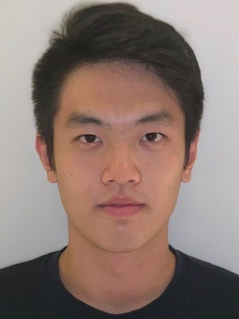
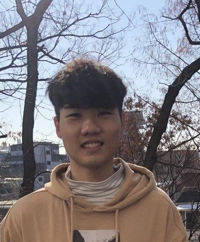
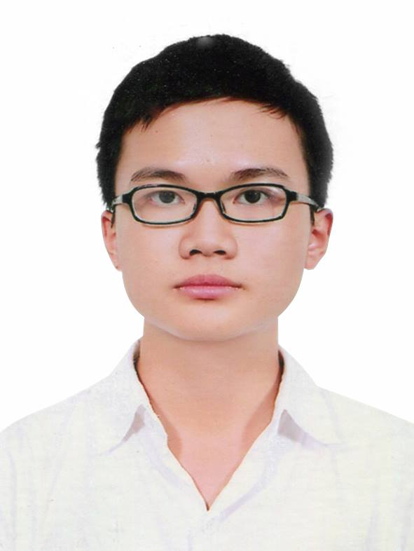

We are a team based in the [School of Computing, National University of Singapore](http://www.comp.nus.edu.sg).

You can reach us at the email `seer[at]comp.nus.edu.sg`

## Project team

### Simon Teo

[[homepage](https://www.linkedin.com/in/simon-teo-94a4a158/)]
[[github](https://github.com/simonteozw)]
[[portfolio](https://github.com/simonteozw/tp)]

* Role: Documentation Master

### Ng Wei Hong

[[github](http://github.com/justweihong)]
[[portfolio](https://github.com/justweihong/tp)]

* Role: UI

### Tiffany Chan

[[github](http://github.com/nottiffchan)] [[portfolio](https://github.com/nottiffchan/tp)]

* Role: Deliverables and Deadlines

### Vuong Hoang Long

[[github](https://github.com/UncleGrandpa925)] [[portfolio](https://github.com/UncleGrandpa925)]

* Role: Team Leader

### Nguyen Dinh Quang Minh

[[github](http://github.com/nguyendqminh)]
[[portfolio](https://github.com/nguyendqminh/tp)]

* Role: Testing Master
