# TrackIt@NUS - Developer Guide

By: `Team W13-4` Since: `Aug 2020` License: `MIT`

## Table of Contents
1. [**Introduction**](#introduction)
2. [**Setting up**](#setup)
3. [**Design**](#design)
    1. [Architecture](#architecture)
    2. [UI Component](#ui)
        1. [Upcoming Tab](#upcoming-tab)
        2. [Module Tab](#module-tab)
        3. [Contact Tab](#contact-tab)
    3. [Logic Component](#logic)
    4. [Model Component](#model)
    5. [Storage Component](#storage)
    6. [Common Classes](#common)
4. [**Implementation**](#implementation)
    1. [Overview](#overview)
        1. [Code Design Considerations](#code-des-cons)
        2. [Feature Design Considerations](#feat-des-cons)
    2. [Module Manager](#module-manager)
    3. [Lesson Manager](#lesson-manager)
    4. [Task Manager](#task-manager)
    5. [Contact Manager](#contact-manager)
    6. [Logging](#logging)
    7. [Configuration](#config)
5. [**Documentation**](#documentation)
6. [**Testing**](#testing)
7. [**Dev Ops**](#devops) 
[**Appendix A: Product Scope**](#appen-a)  
[**Appendix B: User Stories**](#appen-b)  
[**Appendix C: Use Cases**](#appen-c)  
[**Appendix D: Non-Functional Requirements**](#appen-d)  
[**Appendix E: Glossary**](#appen-e)  
[**Appendix F: Instructions for Manual Testing**](#appen-f)  
[**Appendix G: Effort**](#appen-g)  
--------------------------------------------------------------------------------------------------------------------

## **Introduction** 

**TrackIt@NUS** is a desktop application for managing modules, lessons, tasks, and contacts, tailored to the needs of
 NUS students. It focuses on the _Command Line Interface (CLI)_ while providing users with a simple and clean
  _Graphical User Interface (GUI)_. The main interaction with **TrackIt@NUS** will be done via commands.

**TrackIt@NUS** is an all-in-one solution for busy NUS students. The information that can be managed by **TrackIt@NUS** includes:

* Modules
* Lessons (for each module)
* Tasks 
* Contacts

By combining these 4 core functions into a single app, we are able to deliver a unique user experience tailored to
 university students. In addition to the standard CRUD operations, students using TrackIt@NUS will be able to:
 
* View all upcoming tasks
* View all module-specific tasks
* View all upcoming lessons
* View all module-specific lessons
* View all contacts
* View all module-specific contacts (i.e. Professors, TAs, friends in the same module)

Any help on the development of TrackIt@NUS would be greatly appreciated, and there are several ways to do so:

* Contribute to the codebase of TrackIt@NUS by expanding the current set of features
* Write new test cases to improve coverage
* Propose and implement improvements for our existing features

The purpose of this Developer Guide is to help you understand the design and implementation of **TrackIt@NUS** so
 that you can get started on your contributions to the app.

## **Setting up, getting started** 

Refer to the guide [here](./SettingUp.md).

--------------------------------------------------------------------------------------------------------------------

## **Design** 

In this section, you will learn about the general design and structure TrackIt@NUS. Subsequently, this section will
 also describe and explain how each component in TrackIt@NUS works individually. TrackIt@NUS is coded using the
  [_Object Oriented Programming_](#oop) paradigm and it follows the [_Facade Pattern_](#facade-p) and [_Command
   Pattern_](#command-p) in software design.

### **Architecture** 

The ***Architecture Diagram*** given above explains the high-level design of the App. Given below is a quick overview of each component.

:bulb: **Tip:** The `.puml` files used to create diagrams in this document can be found in the [diagrams](https
://github.com/AY2021S1-CS2103T-W13-4/tp/tree/master/docs/diagrams) folder. Refer to the [_PlantUML Tutorial_ at se
-edu/guides](https://se-education.org/guides/tutorials/plantUml.html) to learn how to create and edit diagrams.

**`Main`** has two classes called [`Main`](https://github.com/AY2021S1-CS2103T-W13-4/tp/blob/master/src/main/java/trackitnus/Main.java) and [`MainApp`](https://github.com/AY2021S1-CS2103T-W13-4/tp/blob/master/src/main/java/trackitnus/MainApp.java). It is responsible for,
* At app launch: Initializes the components in the correct sequence, and connects them up with each other.
* At shut down: Shuts down the components and invokes cleanup methods where necessary.

[**`Commons`**](#common-classes) represents a collection of classes used by multiple other components.

The rest of the App consists of four components.

* [**`UI`**](#ui-component): The UI of the App.
* [**`Logic`**](#logic-component): The command executor & the logic
  interface providing APIs for the UI to retrieve necessary data.
* [**`Model`**](#model-component): Holds the data of the App in memory.
* [**`Storage`**](#storage-component): Reads data from, and writes data to, the hard disk.

Each of the four components,

* defines its *API* in an `interface` with the same name as the Component.
* exposes its functionality using a concrete `{COMPONENT_NAME}Manager` class (which implements the corresponding API `interface` mentioned in the previous point.

For example, the `Logic` component (see the class diagram given below) defines its API in the `Logic.java` interface and exposes its functionality using the `LogicManager.java` class which implements the `Logic` interface.

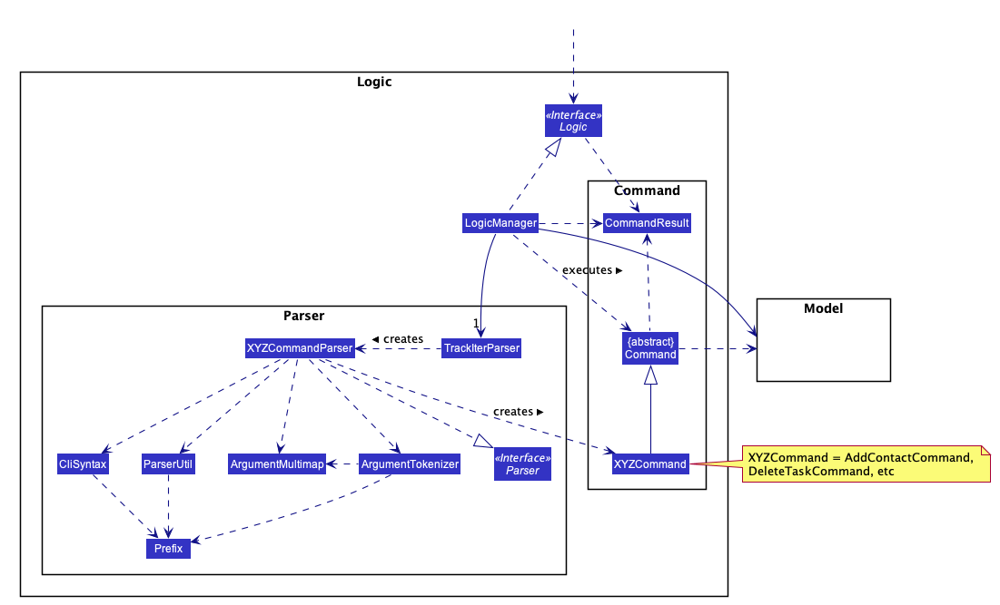

**How the architecture components interact with each other**

The *Sequence Diagram* below shows how the components interact with each other for the scenario where the user issues
 the command `T delete 1`.

Another *Sequence Diagram* below shows how the components interact with each other for the scenario where the user
 clicks on a module tab.

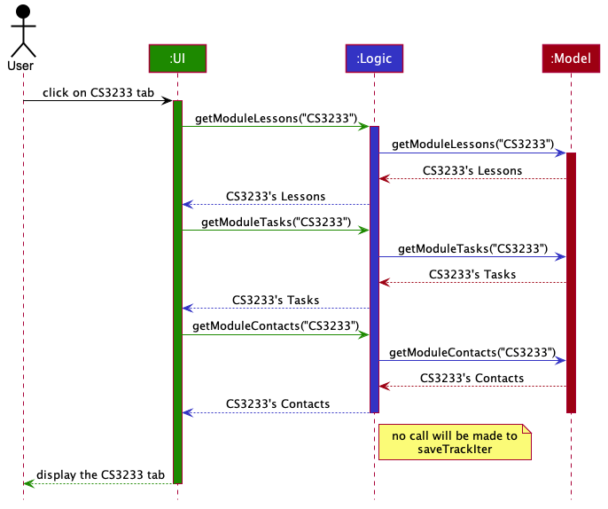

The sections below give more details of each component.

### **UI Component** 

The Class Diagram below shows how the `UI` components and sections interact with one another.

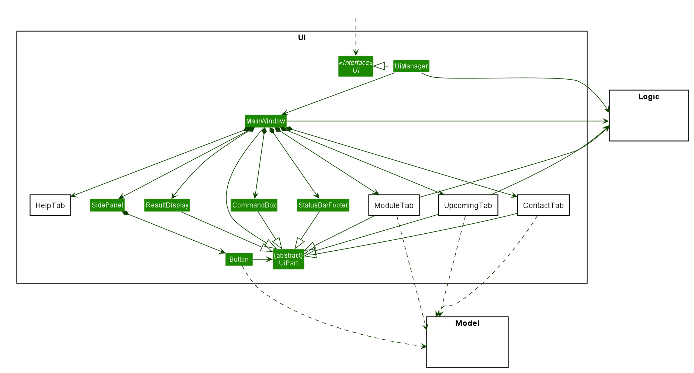

The UI consists of a `MainWindow` that is made up of parts e.g. `SidePanel`, `StatusBarFooter`, `CommandBox
` etc. All these, including the MainWindow, inherit from the abstract UiPart class. The UI also consist of 4 main
 components: `UpcomingTab`, `ModuleTab`, `ContactTab` and `HelpTab`. Each of these components consist of
  several other classes as well. More details of this will be provided in the [sub-sections](#upcoming-tab).

The `UI` component uses JavaFx UI framework. The layout of these UI parts are defined in matching .fxml files that
 are in the `src/main/resources/view` folder. For example, the layout of the `MainWindow` is specified in
  `MainWindow.fxml`.

The UI component,
* Executes user commands using the `Logic` component.
* Listens for changes to `Model` data so that the UI can be updated with the modified data.

#### **Upcoming Tab** 

The *Class Diagram* below shows how the components in the `Upcoming Tab` interact with each other.
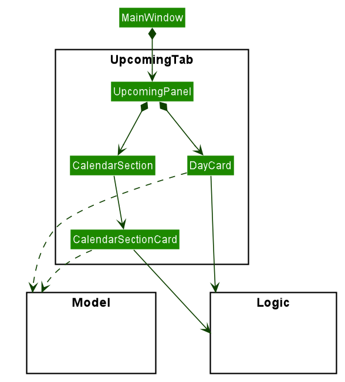

:information_source: All the `ListPanels` and `Cards` inherit from the abstract `UiPart` class.

The UI contains 4 types of `Tabs`:
1. The `Upcoming Tab`
2. `Module Tabs`
3. The `Contacts Tab`
4. The `Help Tab`

Each of these tabs consists of one or more List Panels and its respective Card. In each List Panel, the `Graphics
` component of each of the List Cells is defined by the respective Card.
The `Contacts Tab` and `Help Tab` follow the same structure as the *Class Diagram* above.

#### **Module Tab** 

The Class Diagram below shows how `Module Tab` components interact with each other.

This module tab consist of three panels (`LessonListPanel`, `TaskListPanel`, `ContactListPanel`) and their
 corresponding cards (`LessonCard`, `TaskCard`, `ContactCard`). In all of the panels, the graphics of each of the
  `ListCell` is defined by the respective Cards.
  
  The `ContactTab` and `HelpTab` both follow a similar structure as the above class diagram, except that they each
   consist of 1 single panel.
   
#### **Contact Tab** 

### **Logic Component** 

**API** :
[`Logic.java`](https://github.com/AY2021S1-CS2103T-W13-4/tp/blob/master/src/main/java/trackitnus/logic/Logic.java)

1. `Logic` uses the `TrackIterParser` class to parse the user command.
1. This results in a `Command` object which is executed by the `LogicManager`.
1. The command execution can affect the `Model` (e.g. adding a person).
1. The result of the command execution is encapsulated as a `CommandResult` object which is passed back to the `Ui`.
1. In addition, the `CommandResult` object can also instruct the `Ui` to perform certain actions

Given below is the Sequence Diagram for interactions within the `Logic` component for the `execute("delete 1")` API call.

:information_source: The lifeline for `DeleteTaskCommandParser
` should end at the destroy marker (X) but due to a limitation in PlantUML, the lifeline continues to the end of the diagram

### **Model Component** 

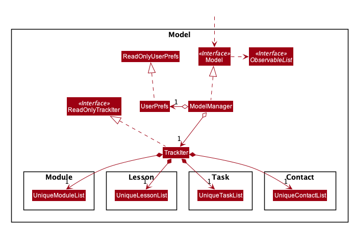

**API** : [`Model.java`](https://github.com/AY2021S1-CS2103T-W13-4/tp/blob/master/src/main/java/trackitnus/model/Model.java)

The `Model`,

* stores a `UserPref` object that represents the user’s preferences.
* stores the TrackIt@NUS data.
* exposes 4 unmodifiable `ObservableList<>` objects:
    * `filteredModuleList`, which contains all the `Modules` in the TrackIt@NUS
    * `filteredLessonList`, which contains all the `Lessons` in the TrackIt@NUS
    * `filteredTaskList`, which contains all the `Tasks` in the TrackIt@NUS
    * `filteredContactList`, which contains all the `Contacts` in the TrackIt@NUS
* These lists can be 'observed' e.g. the UI can be bound to this list so that the UI automatically updates when the data in the list change
* Does not depend on any of the other three components.

### **Storage Component** 

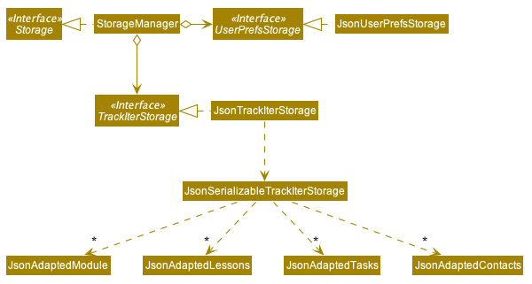

**API** : [`Storage.java`](https://github.com/AY2021S1-CS2103T-W13-4/tp/blob/master/src/main/java/trackitnus/storage/Storage.java)

The `Storage` component,
* can save `UserPref` objects in json format and read it back.
* can save the app's data in json format and read it back.

### **Common Classes** 

The `commons` package contains classes used by multiple other components in the `trackitnus.commons` package.

--------------------------------------------------------------------------------------------------------------------

## **Implementation** 

This section describes some noteworthy details on how certain features are implemented.

### **Overview** 

#### **Code Design Considerations** 
----
**All commands in TrackIt@NUS follow a similar execution flow.**

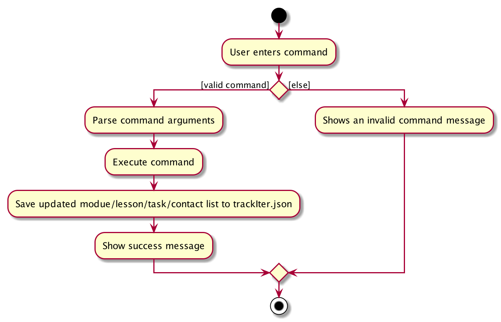

We have done this to improve maintainability. Making our code more uniform will:

* Make testing easier 
* Allow us to track down bugs faster
* Allow us to better use the Single Level of Abstraction (SLAP) principle in our code

In addition, this will make our code base much more organised, and hence make it easier for new developers to quickly
 learn and contribute.
 
Another design challenge was how to manage our predicates. TrackIt@NUS makes use of many different predicates to
 allow users to view specific tasks, lessons, and contacts. For example, users can view module-specific tasks
 , contacts, and lessons. They can also view overdue tasks and future tasks (tasks where the deadline is more than a
  week away). To manage all these predicates, we had 2 options:

|  | Pros | Cons |
| ---- | ----- | ------- |
| **Option 1 (current choice):** Extract each the predicates into their own unique class | Increases code maintainability and testability. Now as a developer you exactly where to find each predicate. Makes use of the DRY principle and improves abstraction because you no longer need to interact with the actual lambda or test function, simply call the predicate. | Makes code more verbose as each predicate can simply be declared using a single lambda. |
| **Option2:** Declare each predicate using a single lambda in the ModelManager class. No predicate will have a class. | Makes code shorter and simpler to read. No need to create a class when you can simply declare a predicate with a lambda. | Need to duplicate such code when using ModelStubs for testing. This will violate the DRY principle. |
----
**All classes of Logic & Model at the same level will have similar structures**

To elaborate on this, we will first take an example on some lowest-level classes of the codebase. They include `Email`, `Address`, `Code`, `Name` ....

All of these classes share a similar structure as 2 classes `Address` and `Code` as below:
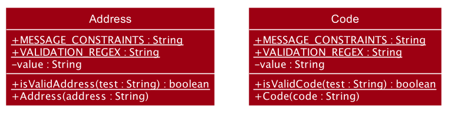

Furthermore, all Add/Edit/Delete commands will share very similar structure, below is the example of AddCommand, EditCommand & DeleteCommand, 
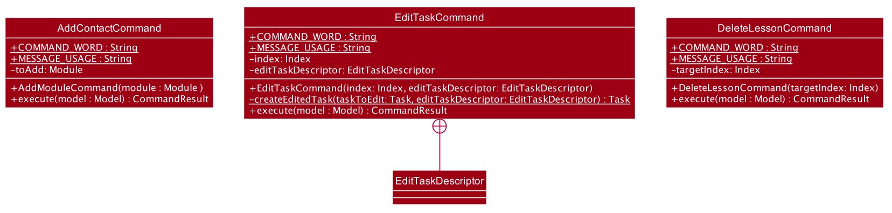

The same principle applies to all CommandParser classes.

This will bring several benefits:
* If a bug is found, we can quickly check same-level classes(that have the similar structure) for the existence of the bug since it's quite likely to contain the same bug
* If any fix/improvement is applied to a class, we can quickly apply the same fix/improvement to other same-level classes
* Improve maintainability of the project. Since the back-end was developed in parallel, each developer was assigned to code at least one "part" of the back-end 
(for example, one can be assigned to write all Module-related classes, subclasses, commands and command-parsers). Yet, due to the similarity in structure 
of classes of the same level, it's very easy for a developer to maintain others' codes.

A possible drawback of this uniform design is that it may not be the most appropriate design for each class, but for this project we believe this drawback doesn't apply.

----

----
**Other code design rules applied**
* A function/method should only do what it's expected to do (which should be inferable from its name), and in no ways should it surprise the caller.

----
#### **Feature Design Considerations** 

The entire app follows a simple principle: the app should behave in the way most normal users expect it to behave. 

Its behaviors should help users complete their intended tasks quickly and conveniently, but avoid getting in their way by forcing users to follow some strange constraints.

The following section states some important feature design considerations the team has made during the development of the app

----
**When the module code is edited, all associated lessons/tasks/contact tags are edited as well**

|  | Pros | Cons |
| ---- | ----- | ------- |
| **Option 1 (current choice):** Edit all related all associated lessons/tasks/contact tags| More **intuitive** to users, because it's **natural** to expect that when a module code is edited, its associated lessons/tasks are modified to still belong to the newly edited module and doesn't become "orphan" entities. For contacts, we believe that **most normal** users also expect the app to change the tag associated with the old code to the new code. | It increases coupling of the codebase, make it more prone to bugs |
| **Option2:** Just edit the module code and leave other stuff untouched | Simplify the app's logic, decrease coupling and "possibly", give users more control over the app | **"Surprise"** most users with its **"unexpected"** behavior, and create some weird logic in the app (for example, where can a lesson/task be displayed if it doesn't belong to an existing module) |

**After having considered all the pros & cons, we have decided to implement this feature so that the user can have the best possible User Experience!**

----

**When a module is deleted, all associated lessons/tasks are deleted but contacts are left untouched**

This behavior of the app has been considered (and debated) thoroughly. The following are our rationale:
* We believe it's rare that users need to delete a module (even if they entered the code or name wrongly, they can still edit those fields). So, if they have decided to delete a module, it is likely they have finished(or dropped) that module
, so the app's expected behavior is to delete all the module's associated tasks/lessons.
* Deleting a contact usually means the user no longer want to connect with that contact, which is rarely the case because it's almost always better to have more contacts so that one can seek help when necessary (or "just in case"). 
Hence, we decided to give users full control over their contacts (even the to-be-deleted module's related tag will not be deleted, so that users can keep track of a contact's related modules).

Similar to the previous module edit, one clear drawback of implementing this behavior is it will complicate the app's logic and make the app more bug-prone.

**After having considered all the pros & cons, we have decided to implement this feature so that the user can have the best possible User Experience!**

----

**Allow users to use mouse to click on tabs**

_This feature is one of the most debated features in our team._ 

We are well aware of the module's constraints that the app must be optimized for CLI. 

Yet, 5 todo-apps have been studied by our team (macOS's reminders, Microsoft To Do, Todoist, OmniFocus) and we found all of these apps only have one way to change tabs, and it is by clicking on them. 
Although forcing users to use CLI to change tab can be easily implemented, it will make the app unintuitive to most users (except CLI gurus), and hence **cannot attract new users** to change to our new app from their old apps(of which they are so used to clicking on tabs). 

Also, even for CLI gurus, typing something like `switch CS2030` to switch to a new tab while it can be done with just a single click is not something we think they will do. 

One last reason is that we think it's very convenient for users to use mouse to click on various different tabs in during a short period to just get a sense of upcoming tasks & lessons and related contacts to help them. This "fast jump between tabs" cannot be done by CLI.

----

**Edit/Delete contacts/lessons/tasks by Index**

|  | Pros | Cons |
| ---- | ----- | ------- |
| **Option 1 (current choice):** Use Index to edit/delete | Very "intuitive" for users, they can use the index being displayed to edit/delete the entity they need to | Cannot delete contacts from the upcoming tab. There is no concrete Id for tasks/lessons/contacts, theirs Ids (in this case: index) depends on their position in the current tab|
| **Option2:** Assign each contact/lesson/task a concrete Id | Each entity is associated with only one Id, can edit/delete anywhere in the app | Force users to remember long sequences of Ids and hence create a mental burden everytime they want to edit/delete an entity |

**We have chosen the 1st option to make users feel comfortable using our app**

----
**Unified command syntax**

We have put in a lot of effort to make the command syntax unified, means that all commands have very similar syntax. They can be observed from the following tables:

| Command | Format |
| -- | -------- |
| add module | `M add m/CODE n/NAME` | 
| add lesson | `L add m/CODE t/TYPE d/DATE a/ADDRESS` | 
| add task | `T add n/NAME d/DATE [m/CODE] [r/REMARK]` | 
| add contact | `C add n/NAME p/PHONE_NUMBER e/EMAIL [t/TAG]...` | 

| Command | Format |
| -- | -------- |
| edit module | `M edit CODE [m/NEW_CODE] [n/NAME]` | 
| edit lesson | `L edit INDEX [m/CODE] [t/TYPE] [d/DATE] [a/ADDRESS]` | 
| edit task | `T edit INDEX [n/NAME] [d/DATE] [m/CODE] [r/REMARK]` | 
| edit contact | `C edit INDEX [n/NAME] [p/PHONE_NUMBER] [e/EMAIL] [t/TAG]...` |

| Command | Format |
| -- | -------- |
| delete module | `M delete CODE` | 
| delete lesson | `L delete INDEX` |
| delete task | `T delete INDEX` | 
| delete contact | `C delete INDEX` | 

| Command | Format |
| -- | -------- |
| help | `help` |
| exit | `exit` |

This will relieve our users from the mental burden of having to remember different syntax for different commands. Although there are only 14 commands to get used to, having to remember all 14 of them will be a huge barrier for our new potential users and also, it will put an unnecessary mental burden on the users of our app.

----
**Other small feature considerations**
|  | Rationale |
| ---- | ----- |
| No limit on length of phone number | We have looked at Android's and iOS's contact app and no app imposes limits on the length of phone number |
| Only basic validation of email address | We believe that the app should only prevent user from accidentally entering phone number/name inside the email field (to provide additional convenience). It's challenging to valid the validity of email (need to check if the domain exists...) yet it's unnecessary since it's the user's own benefits to input valid emails |
| Minimal restriction on lessons' time | We believe that the app should provide users full control over their schedule (for example overlapping lesson time) to cater to a wide range of different users' needs. Moreover, it's the user's own benefits to input maintain a correct lesson schedule |
| Edit/Delete modules by code | Editing/Deleting modules is an action that users will rarely do (maybe a few times every semester). We believe the UI shouldn't be cluttered by some info that users will only need once every semester, so we have decided to omit the Index for modules to make the UI cleaner | 

### **Module Manager** 

TrackIt@NUS allows users to keep track of all modules that he/she is taking. Module (or more exactly module's code) is
 the link between Lesson, Task and Contact. The following diagram illustrates their relationship:
 
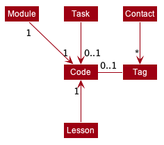
     
 :information_source: The module code needs to begin with 2-3 capital letters, then exactly 4 digits, then follows by
  an optional capital letter. The module name must not be empty and doesn't contain character "/"
      
 :information_source: modules are allowed to have the same name, as long as they have different codes
 
 :bulb: Since there is no index being shown for a module, the module can be edited/deleted only by its code. 
 For example: 
 * `M edit CS2030 m/CS2040 n/Edited name` to change the code of CS2030 to CS2040, and change its name to "Edited name"
 * `M delete CS2030` to delete the CS2030 module
 

#### Current Implementation

In this section, we will outline the key operations of the Module Manager, namely:
* `AddModuleCommand`
* `DeleteModuleCommand`
* `EditModuleCommand`

Before we begin, it is important for us to define 1 key term: **association**:

:information_source: A lesson/task is associated with a module if its **code** field is equal to the
 module's **code**.
 
:information_source: A contact is associated with a module if it contains that module's code as 1 of its tags
 
The add, delete, and edit commands are all implemented in similar ways. When they are executed they will:
 * call on the relevant Model methods
 * update the `UniqueModuleList` depending on the command
 * Save the updated module list to `data/trackIter.json`
 * return the relevant CommandResult message

In this section, we will use the following Activity Diagram to outline the parse & execution of a AddModuleCommand

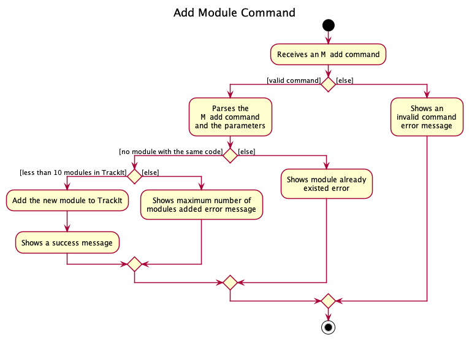

When the user enters the `M add m/CODE n/NAME` command to add a new module, the user input command undergoes the same command parsing as described in 
[Section 3.3 Logic Component](#33-logic-component). If the parse process is successful, a `AddModuleCommand` will be returned an its `execute` method will be called.

The following steps will describe the execution of the `AddModuleCommand` in detail, assuming no errors are encountered.
1. The `Model`'s `hasModule(code)` is called. If it returns `true`, a `CommandException` will be thrown.
2. The `Model`'s `canAddMoreModule()` is called. If it returns `true`, a `CommandException` will be thrown.
3. The `Model`'s `addModule()` is called to add the module from TrackIt
4. The `Ui` component will detect this change and update the GUI.
5. Assuming the above steps are all successful, the `AddModuleCommand` will then create a `CommandResult` object and return the result.

The following Sequence Diagram will illustrate the above steps in greater detail :

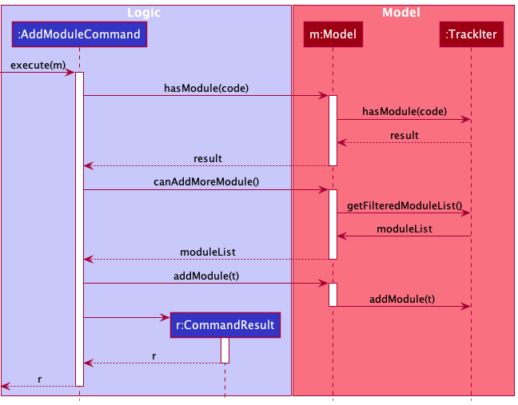

In this section, we will use the following Activity Diagram to outline the parse & execution of a DeleteModuleCommand

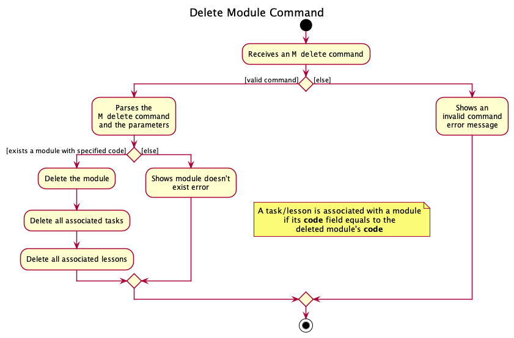

When the user enters the `M delete CODE` command to delete a module, the user input command undergoes the same command parsing as described in 
[Section 3.3 Logic Component](#33-logic-component). If the parse process is successful, a `DeleteModuleCommand` will be returned an its `execute` method will be called.

The following steps will describe the execution of the `DeleteModuleCommand` in detail, assuming no errors are encountered.
1. The `Model`'s `getModule(code)` is called and it will return an Optional<Module> to delete. If the returned optional is empty, a `CommandException` will be thrown.
2. The `Model`'s `getModuleTasks()` is called to get the list of tasks that are associated with the module. 
3. For each task received from the above step, the `Model`'s `deleteTask()` will be called to delete the task from TrackIt
4. The `Model`'s `getModuleLessons()` is called to get the list of lessons that are associated with the module. 
5. For each lesson received from the above step, the `Model`'s `deleteLesson()` will be called to delete the lesson from TrackIt
7. The `Model`'s `deleteModule()` is called to delete the module from TrackIt
8. The `Ui` component will detect this change and update the GUI.
9. Assuming the above steps are all successful, the `DeleteModuleCommand` will then create a `CommandResult` object and return the result.

The following Sequence Diagram will illustrate the above steps in greater detail :

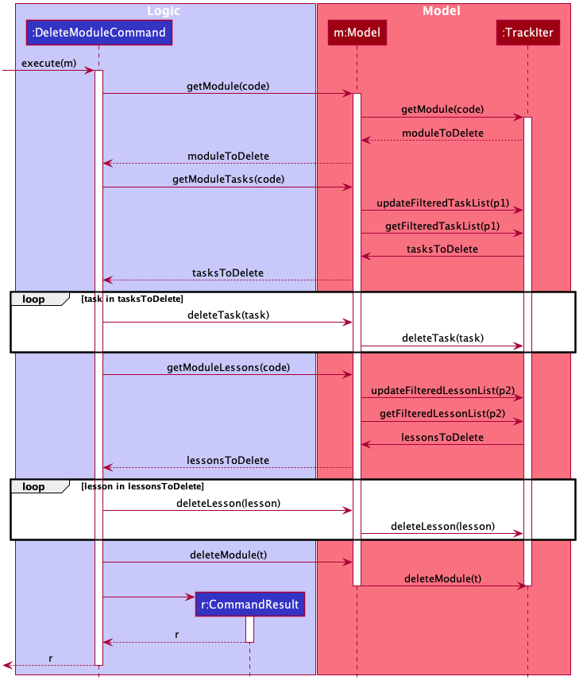
     
In this section, we will use the following Activity Diagram to outline the parse & execution of a EditModuleCommand

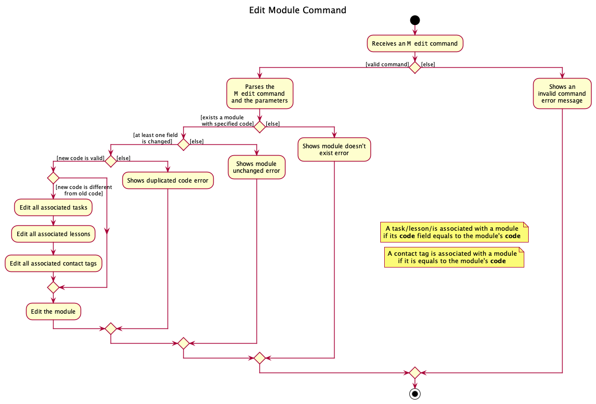

When the user enters the `M edit CODE` command to edit a module, the user input command undergoes the same command parsing as described in 
[Section 3.3 Logic Component](#33-logic-component). If the parse process is successful, a `EditModuleCommand` will be returned an its `execute` method will be called.

The following steps will describe the execution of the `EditModuleCommand` in detail, assuming no errors are encountered.
1. The `Model`'s `getModule(code)` is called and it will return an Optional<Module> to edit. If the returned optional is empty, a `CommandException` will be thrown.
2. The `Model`'s `createEditedModule` is called to create the new `editedModule` to replace the old `Module`
3. If `editedModule` is equal to the old `Module`, a `CommandException` will be thrown.
4. If the `code` of `editedModule` coincides with one of the `code` of existing module, a `CommandException` will be thrown.
5. If the `code` of the `editedModule` is different from the old `Module`'s `code`:
    1. The `Model`'s `getModuleTasks()` is called to get the list of tasks that are associated with the module
    2. For each task in the above step, a `newTask` is created by replacing its old `code` with the new `code`, then `Model`'s `setTask()` is called to replace `oldTask` with `newTask`
    3. The `Model`'s `getModuleLessons()` is called to get the list of lessons that are associated with the module
    4. For each lesson in the above step, a `newLesson` is created by replacing its old `code` with the new `code`, then `Model`'s `setLesson()` is called to replace `oldLesson` with `newLesson`
    5. The `Model`'s `getModuleContacts()` is called to get the list of contacts that associated with the module
    6. For each contact in the above step, a `newContact` is created by deleting the old `code` from the set of tags and add in the new `code`, then `Model`'s `setContact()` is called to replace `oldContact` with `newContact`
7. The `Model`'s `setModule()` is called to edit the module from TrackIt
8. The `Ui` component will detect this change and update the GUI.
9. Assuming the above steps are all successful, the `EditModuleCommand` will then create a `CommandResult` object and return the result.

The following Sequence Diagram will illustrate the above steps in greater detail :

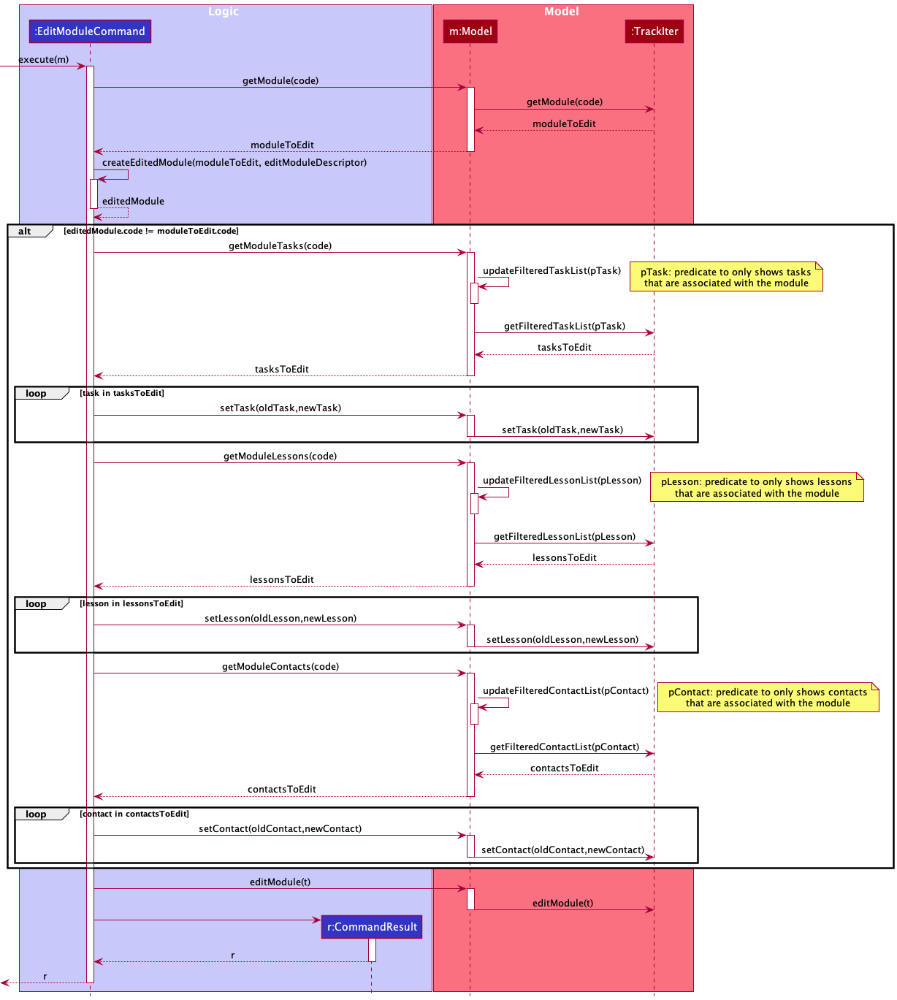

### **Lesson Manager** 

TrackIt@NUS allows users to keep track of their weekly lessons. The lesson manager is one of TrackIt@NUS's basic components.

The common commands for the lesson manager include:

* `add` - Creates a new lesson
* `edit` - Modifies an existing lesson
* `delete` - Deletes an existing lesson

TrackIt@NUS also gives users a better understanding of their lessons by allowing users to view lessons in certain 
categories. Users can view lessons specific to a module and lessons on a specific day.

 #### Rationale
 
 Lessons are an integral part of any student's day-to-day life. Hence, TrackIt@NUS includes a lesson manager for students to 
 keep track of their lessons. Each lesson must belong to a unique module. When users click into a specific module tab, 
 they can see the lessons belonging to that module.
   
:warning: The module must exist (i.e. there must be a module with the specified `CODE`), otherwise, the `add` and
 `edit` commands will not work.
 
 #### Current Implementation
 
 In this section, we will outline the key operations of the Lesson Manager, namely:
 * `AddLessonCommand`
 * `DeleteLessonCommand`
 * `EditLessonCommand`
 
 We will also elaborate on one more key operation that is used in the module tabs, namely `getModuleLessons`.
  
 The `add`, `delete`, and `edit` commands are all implemented in similar ways. When executed they will:
  * call on the relevant Model methods
  * update the `UniqueLessonList` depending on the command
  * Save the updated lesson list to `data/trackIter.json`
  * return the relevant CommandResult message
 
 The following steps will describe the execution of the `AddLessonCommand`, assuming no errors are encountered:
 
 1. When `AddLessonCommand` is executed, it will first call the model's `hasModule` method to ensure that the specified module exists
 2. Following this, it will call the model's `hasLesson` method to ensure that the lesson does not yet exist in the app
 3. If both checks pass, `AddLessonCommand` will call the model's `addLesson` method
 4. The model will then call the `addLesson` method of TrackIter, and adds the lesson to the app.
 
 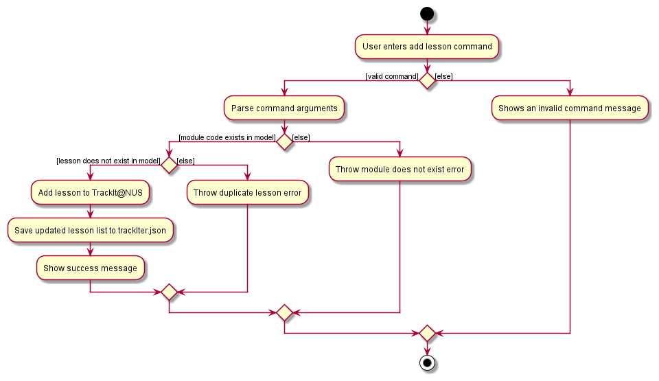
 
 The following shows the sequence diagram of the `AddLessonCommand`.
 
 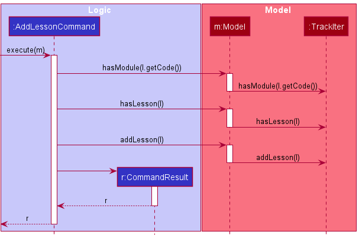
 
 The following steps will describe the execution of the `DeleteLessonCommand`, assuming no errors are encountered:
 
 1. When the `DeleteLessonCommand` is executed, it will first call the model's `getFilteredLessonList` method 
 to determine the last shown list of lessons
 2. Then, it will call the index's `getZeroBased` method to find the zero-based index of the lesson it must delete
 3. Then, it will check if this index is within range
 4. If it is, it calls the model's `deleteLesson` method.
 5. The model will then call the `removeLesson` method of TrackIter, which deletes the lesson in question from the app.
 
 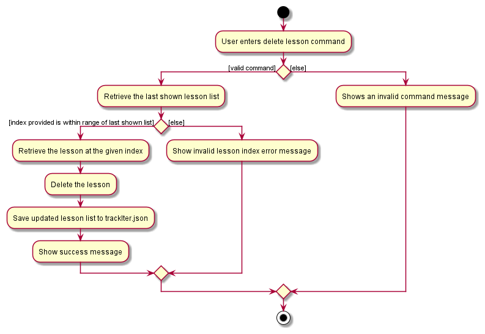
 
 The following shows the sequence diagram of the `DeleteLessonCommand`.
 
 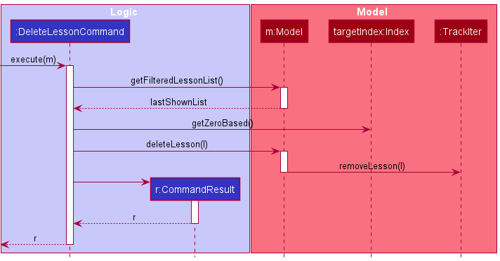
 
 The following steps will describe the execution of the `EditLessonCommand`, assuming no errors are encountered:
 
 1. When the `EditLessonCommand` is executed, it will first call the model's `getFilteredLessonList` method to determine 
 the last shown list of lessons
 2. Then, it will call the index's `getZeroBased` method to find the zero-based index of the lesson we must edit
 3. It will then check if the index is within range
 4. If it is, it calls the model's `setLesson` method
 5. The model will then call the `setLesson` method of TrackIter, which replaces the original lesson with the edited
  version in the app.
  
 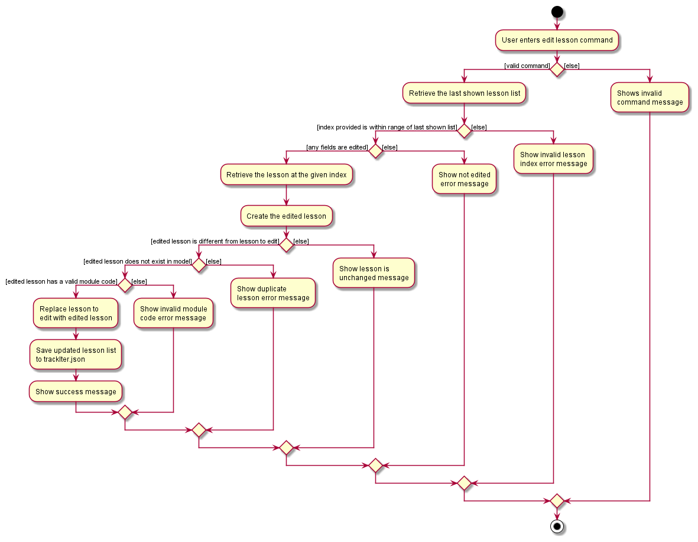
 
 The follow shows the sequence diagram of the `EditLessonCommand`.
 
 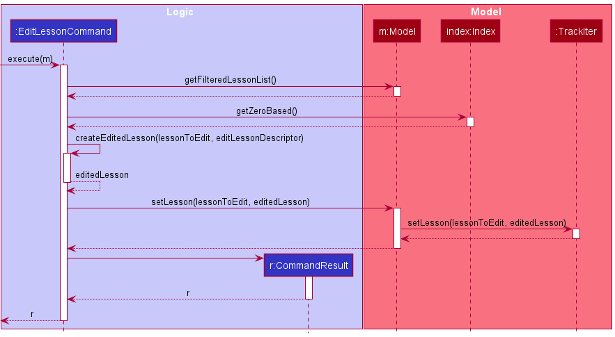
 
 The `getModuleLessons` function takes in a Module Code and returns all lessons that belong to the specified module.
  When `getModuleLessons` is called, it uses the `LessonHasCodePredicate` to update the lesson list in the app to only show
  the lessons that belong to the specified module code.
 
 This is the sequence diagram of `getModuleLessons`.
 
 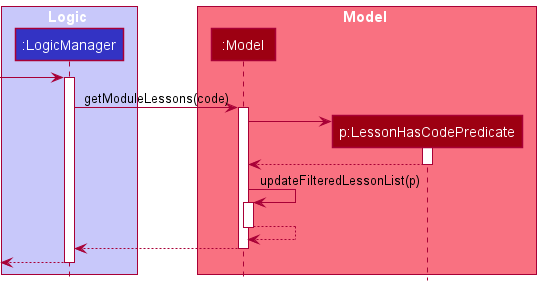

### **Task Manager** 

TrackIt@NUS allows users to keep track of his/her tasks. The task manager is one of TrackIt@NUS's basic components.

The common commands for the task manager include:

* `add` - Creates a new task
* `edit` - Modifies an existing task
* `delete` - Deletes an existing task

TrackIt@NUS also gives users a better understanding of their tasks by allowing users to view tasks in certain
 categories. Users can view overdue tasks, tasks on a specific day, future tasks (tasks that have deadlines more than
  a week away), and specific module tasks.
 
 #### Rationale
 
 Tasks are an integral part of any student's day-to-day life. Hence, TrackIt@NUS includes a task manager for students to 
 keep track of all their tasks. To better support NUS students, a task can either belong to a module or not. When
  adding a task, users can choose to the include the `m/CODE` parameter in order to add a task that belongs to
   a module. When users click into a specific module tab, they can see the tasks belonging to each module.
    
:information_source: A task does not have to belong a module. In this case, the module parameter of the task is
 simply treated as null and the task can only be viewed in the upcoming tab.
     
:warning: The module must exist (i.e. there must be a module with the specified `CODE`) otherwise the add and
 edit commands will not work.
 
:bulb: To remove a task from a module, simply type `T edit INDEX m/` (use the `m/` prefix but leave the `CODE` parameter empty).

#### Current Implementation

In this section, we will outline the key operations of the Task Manager, namely:
* `AddTaskCommand`
* `DeleteTaskCommand`
* `EditTaskCommand`

We will also elaborate on one more key operation that is used in the module tabs, namely `getModuleTasks
`, `getOverdueTasks`, `getDayUpcomingTasks`, `getFutureTasks`.
 
The add, delete, and edit commands are all implemented in similar ways. When they are executed they will:
 * call on the relevant Model methods
 * update the `UniqueTaskList` depending on the command
 * Save the updated task list to `data/trackIter.json`
 * return the relevant CommandResult message

The following steps will describe the execution of the `AddTaskCommand`, assuming no errors are encountered:
 
1. When `AddTaskCommand` is executed, it will first call the model's `hasTask` method to ensure that the task does not yet exist in the app
2. Following this, if the task is added with a non-null module code, it will call the model's
  `hasModule` method to ensure that the specified module exists
3. If both these checks pass, `AddTaskCommand` will call the model's `addTask` method.
4. The model will then call the `addTask` method of TrackIter, and adds the task to the app.

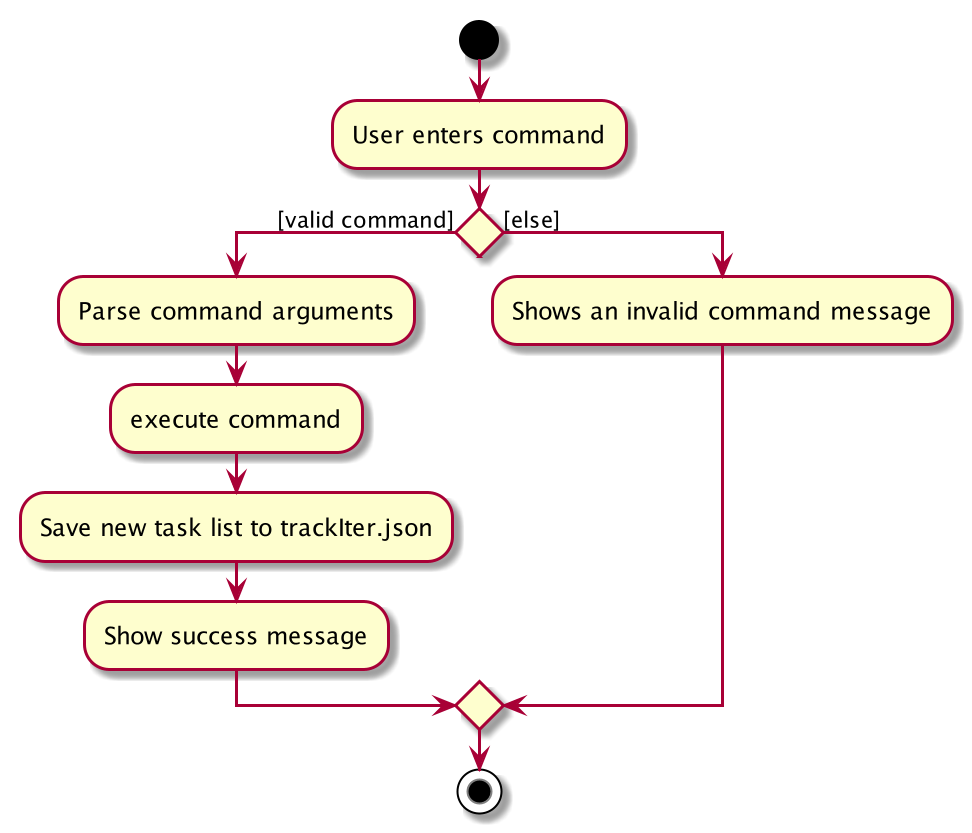

The following shows the sequence diagram of the `AddTaskCommand`.

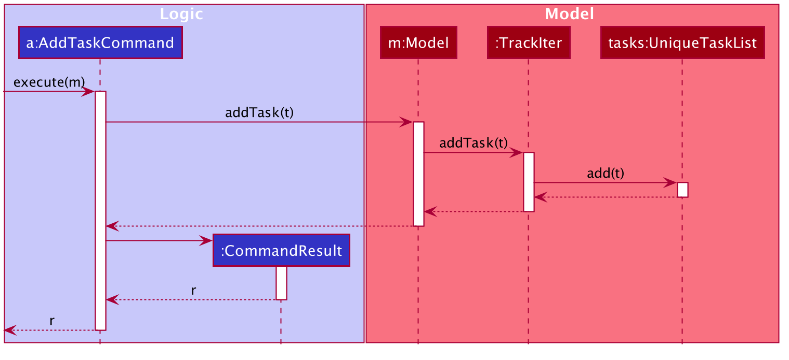

The following steps will describe the execution of the `DeleteTaskCommand`, assuming no errors are encountered:

1. When the `DeleteTaskCommand` is executed, it will first call the model's `getFilteredTaskList` method to determine the last shown list of tasks
2. Then, it will call the index's `getZeroBased` method to find the zero-based index of the task it must delete
3. Then, it will check if this index is within range
4. If it is, it calls the model's `deleteTask` method.
5. The model will then call the `removeTask` method of TrackIter, which deletes the task in question from the app.

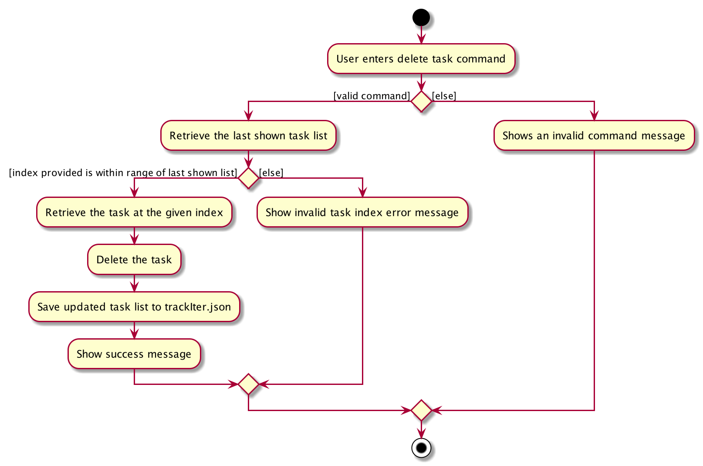

The following shows the sequence diagram of the `DeleteTaskCommand`.

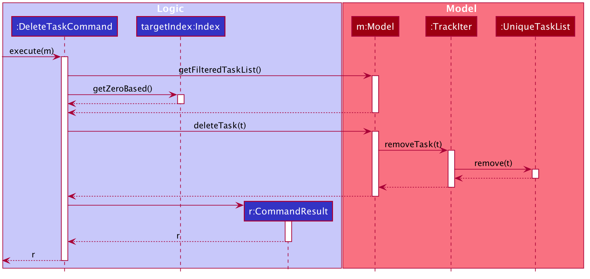

The following steps will describe the execution of the `EditTaskCommand`, assuming no errors are encountered:

1. When the `EditTaskCommand` is executed, it will first call the model's `getFilteredTaskList` method to determine the last shown list of tasks
2. Then, it will call the index's `getZeroBased` method to find the zero-based index of the task we must edit
3. It will then check if the index is within range
4. If it is, it calls the model's `setTask` method
5. The model will then call the `setTask` method of TrackIter, which replaces the original task with the edited
 version in the app.
 
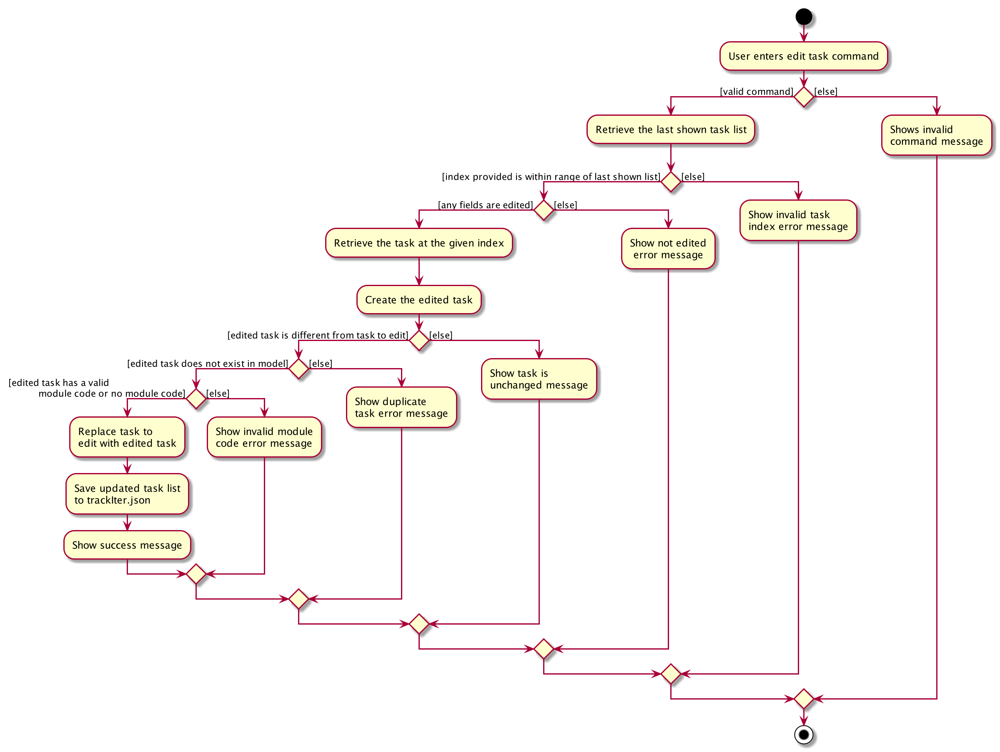

The follow shows the sequence diagram of the `EditTaskCommand` assuming no errors are encountered.

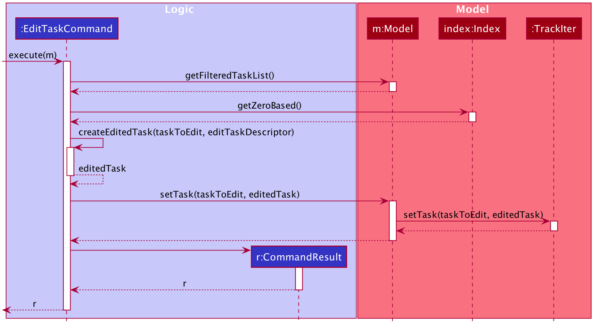

The `getModuleTasks` function takes in a Module Code and returns all tasks that belong to the specified module.
. When `getModuleTasks` is called, it uses the `TaskHasCodePredicate` to update the task list in the app to only show
 the tasks that belong the specified module code.

This is the sequence diagram of `getModuleTasks`.

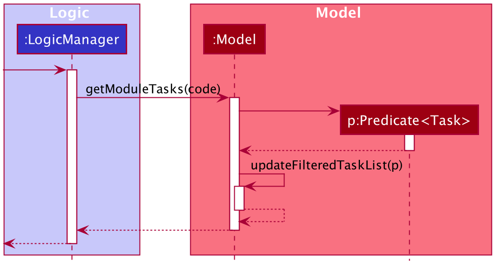

`getOverdueTasks`, `getDayUpcomingTasks`, and `getFutureTasks` are all implemented in very similar ways. In fact, the
 only differences are the predicates used.

#### Design Considerations

As mentioned, a task may or may not belong to a module. In the case it does not, we store the module code as
 null. A task also may or may not have a remark. In the case it does not, we store the remark as the empty
  string. These 2 optional fields made the `EditTaskCommand` more challenging to implement. We wanted the user to be
   able to remove an existing module code or remark simply by typing `T edit INDEX m/` and `T edit INDEX r/` respectively.
     
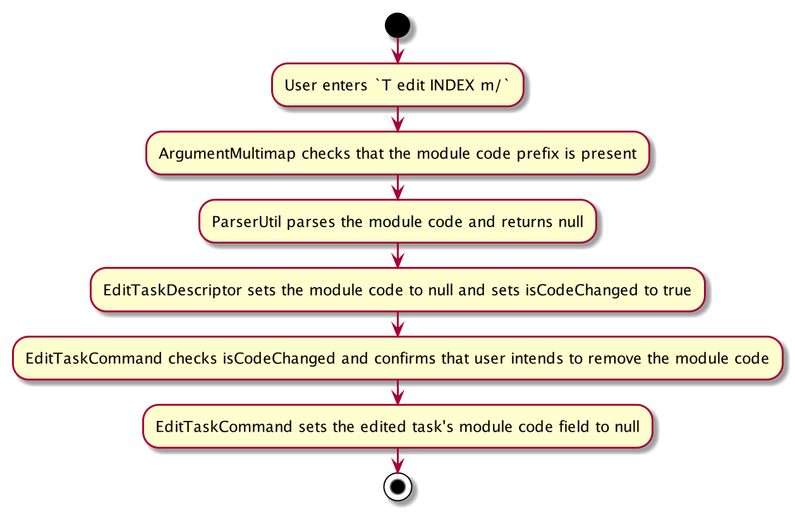
   
The original AB3 implementation of edit commands, which would default to the original field if the edited
 field was null, would not be sufficient. Hence, we added 2 additional boolean variables - `isRemarkChanged` and
  `isCodeChanged`, to know whether users wanted to remove the existing module code or remark.
 
### **Contact Manager** 

TrackIt@NUS allows users to manage their contacts. The contact manager is one of TrackIt@NUS's basic components.

The common commands for the contact manager include:

* `add` - Creates a new contact
* `edit` - Modifies an existing contact
* `delete` - Deletes an existing contact
 
We will also elaborate on one more key operation that is used in the module tabs, namely `getModuleContacts`.
 
 #### Rationale
 
 Managing contacts is an essential part of any student's life. Hence, TrackIt@NUS includes a contact manager for students to 
 keep track of all their contacts. To better support NUS students, a contact can hold any number (can be 0) of tags. If a tag matches 
 an existing module code, editing/deleting the module will edit/delete the tag as well.
    
:bulb: To remove all tags from a contact, simply type `C edit INDEX t/` (use the `t/` prefix but do not provide any tag).

#### Current Implementation

In this section, we will outline the key operations of the Contact Manager, namely:
* `AddContactCommand`
* `DeleteContactCommand`
* `EditContactCommand`
 
The `add`, `delete`, and `edit` commands are all implemented in similar ways. When they are executed they will:
 * call on the relevant Model methods
 * update the `UniqueContactList` depending on the command
 * Save the updated contact list to `data/trackIter.json`
 * return the relevant CommandResult message

The following steps will describe the execution of the `AddContactCommand`, assuming no errors are encountered:
 
1. When `AddContactCommand` is executed, it will first call the model's `hasContact` method to ensure that the contact 
does not yet exist in the app.
2. If the check passes, `AddContactCommand` will call the model's `addContact` method.
3. The model will then call the `addContact` method of TrackIter, and adds the contact to the app.

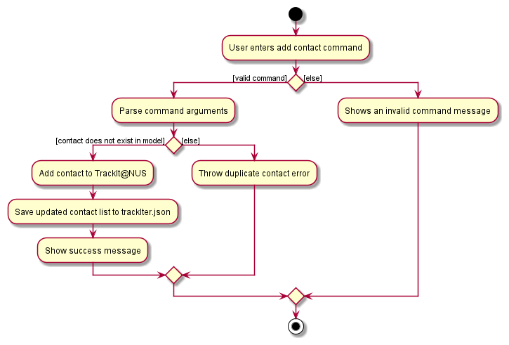

The following shows the sequence diagram of the `AddContactCommand`.

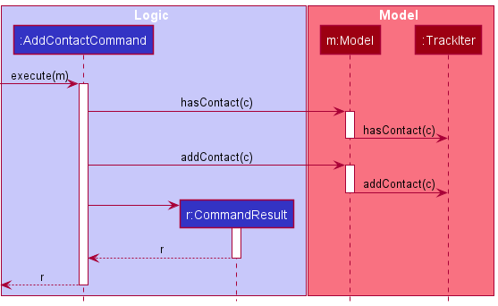

The following steps will describe the execution of the `DeleteContactCommand`, assuming no errors are encountered:

1. When the `DeleteContactCommand` is executed, it will first call the model's `getFilteredContactList` method 
to determine the last shown list of contacts.
2. Then, it will call the index's `getZeroBased` method to find the zero-based index of the contact it must delete.
3. Then, it will check if this index is within range.
4. If it is, it calls the model's `deleteContact` method.
5. The model will then call the `removeContact` method of TrackIter, which deletes the contact in question from the app.

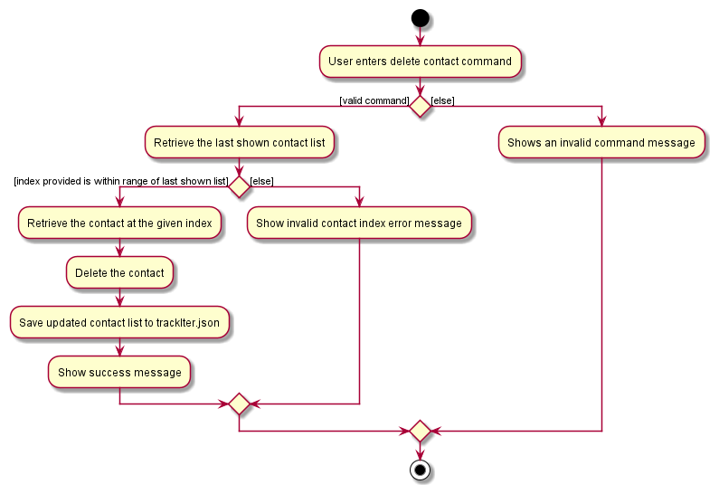

The following shows the sequence diagram of the `DeleteContactCommand`.

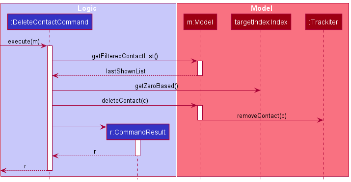

The following steps will describe the execution of the `EditContactCommand`, assuming no errors are encountered:

1. When the `EditContactCommand` is executed, it will first call the model's `getFilteredContactList` method 
to determine the last shown list of contacts.
2. Then, it will call the index's `getZeroBased` method to find the zero-based index of the contact we must edit.
5. It will then check if the index is within range.
6. If it is, it calls the model's `setContact` method.
7. The model will then call the `setContact` method of TrackIter, which replaces the original contact with the edited
 version in the app.
 
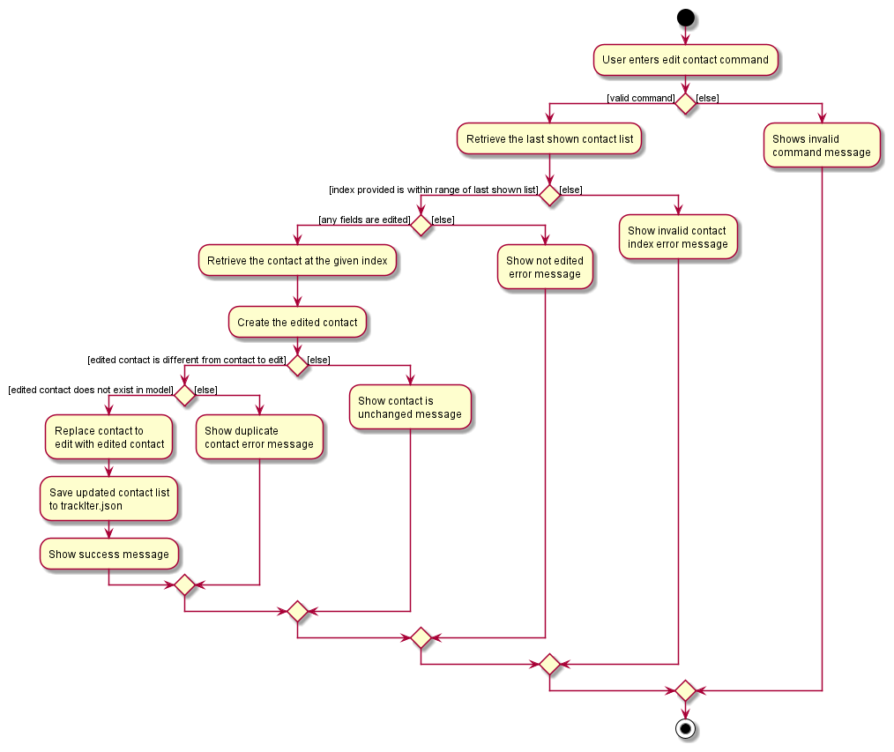

The follow shows the sequence diagram of the `EditContactCommand` assuming no errors are encountered.

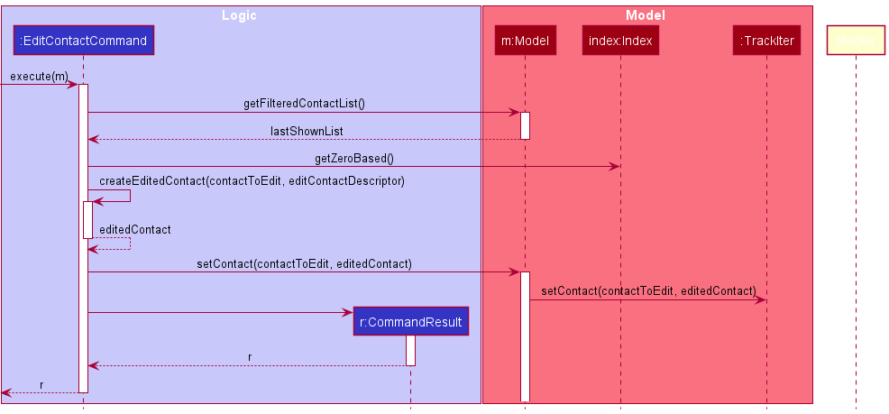

The `getModuleContacts` function takes in a Module Code and returns all contacts that have a tag that matches the specified module.
When `getModuleContacts` is called, it uses the `ContactHasTagPredicate` to update the contact list in the app to only show
 the contacts that have the desired tag.

This is the sequence diagram of `getModuleContacts`.

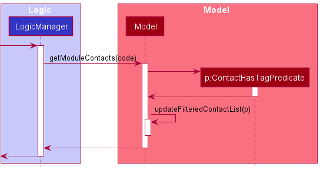

#### Design Considerations

A number of fields in a contact (namely phone number and e-mail address) are optional. In the case they are not specified, 
 we store them as null. Similar to tasks, we wanted users to be able to remove any optional field simply by 
  specifying the `/p` or `/e` flag without providing a parameter.
   
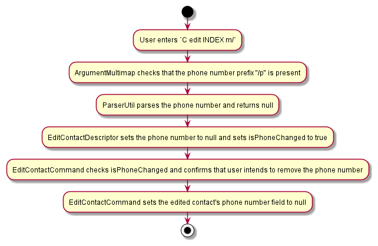
   
The original AB3 implementation of edit commands, which would default to the original field if the edited
 field was null, would not be sufficient. Hence, we added 2 additional boolean variables - `isPhoneChanged` and 
  `isEmailChanged`, to know whether users wanted to remove the existing phone number and/or e-mail address.

### **Logging** 

* We are using `java.util.logging` package for logging.
* The `LogsCenter` class is used to manage the logging levels and logging destinations
*  The `Logger` for a class can be obtained using `LogsCenter.getLogger(Class)` which will log messages according to the specified logging level
*  Log messages are output through the console and to a `.log` file
*  The output logging level can be controlled using the `logLevel` setting in the configuration file (see
 [Configuration](#config) for more info)
* When choosing a level for a log message, follow the conventions stated below

#### Logging Levels

* `SEVERE`: A critical problem detected which may cause the termination of the application
* `WARNING`: Can continue, but with caution
* `INFO`: Information showing the noteworthy actions by the App
* `FINE`: Details that is not usually noteworthy but may be useful in debugging e.g. print the actual list instead of just its size

### **Configuration** 

Certain properties of the application can be controlled (e.g user preferences file location, logging level) through the configuration file (default: `config.json`).

--------------------------------------------------------------------------------------------------------------------

## **Documentation** 

Refer to the guide [here](./Documentation.md)

## **Testing** 

Refer to the guide [here](./Testing.md)

## **Dev Ops** 

Refer to the guide [here](./DevOps.md)

--------------------------------------------------------------------------------------------------------------------

## **Appendix A: Product Scope** 

**Target user profile**:

* university students
* take multiple modules
* want to easily know the events lined up in their week ahead
* want to have their personal todos integrated with the academic calendar
* want to access related contacts when they browse a module
* want to keep track of module details (relevant lessons, tasks, and contacts)
* prefer desktop apps over other types
* can type fast
* prefers typing to mouse interactions
* is reasonably comfortable using [CLI](#cli) apps

**Value proposition**
* An all-in-one student life manager, that simplifies the lives of university students by combining the ability to
 manage four key aspects of student life into one app. Students will be able to know every important thing they have
  upcoming as well as every module-related thing they currently have.
* TrackIt@NUS can manage your student life faster than the typical mouse/[GUI](#gui) app.

## **Appendix B: User stories** 

Priorities: High (must have) - `* * *`, Medium (nice to have) - `* *`, Low (unlikely to have) - `*`

| Priority | As a …​                                    | I want to …​                                                   | So that I can…​                                                        |
| -------- | -------------------- | ---------------------------------------------------------------------- | ---------------------------------------------------------------------- |
| `* * *`  | student              | have all modules' important dates in one place                         | never miss any event                                                   |
| `* * *`  | student              | have information (name, description, time) about any important dates   | always know what to prepare                                            |
| `* * *`  | student              | have all the tutorial/lab details (Zoom link, time) in one place       | easily find them when I need it                                        |
| `* * *`  | forgetful student    | find the grading structure of a module                                 | better revise for each assignment / mid-term / exam                    |
| `* *`    | student              | have all the module descriptions in one place                          | read them if I need to                                                 |
| `*`      | struggling student   | access the contact information of my TA/Prof                           | ask question or schedule a consultation                                |

## **Appendix C: Use cases** 

(For all use cases below, the **System** is the `TrackIt@NUS` application and the **Actor** is the `user`, unless specified otherwise)

**Use case: Find the grading structure of a module**

**MSS**

1.  User requests to list the modules
2.  TrackIt@NUS shows a list of all modules
3.  User requests to find the grading structure of a module in the list
4.  TrackIt@NUS shows the requested grading structure

    Use case ends.

**Extensions**

* 2a. The list is empty.

  Use case ends.

* 3a. The given index (or module name) is invalid.

    * 3a1. TrackIt@NUS shows an error message.

      Use case resumes at step 2.

## **Appendix D: Non-Functional Requirements** 

1.  Should work on any _mainstream OS_ as long as it has Java `11` or above installed.
2.  A user with **above average typing speed** for regular English text (i.e. not code, not system admin commands) should
 be able to accomplish most of the tasks faster using commands than using the mouse.
3.  A user should be able to easily see why their commands are invalid
4.  The app should be able to run with or without internet connection
5.  The app should not require user to install
6.  Features implemented should be easily testable by manual testing, and possible to be tested by automated testing.
7.  The UI of the app makes users comfortable using it
8.  Users of the app find the app intuitive and easy to use
9.  The app should be able to save data locally
10. The app should be for a single user i.e. (not a multi-user product).
11. The app should be able to start up sufficiently fast (<5s).
12. The app should not crash in the event of invalid user input

## **Appendix E: Glossary** 
| **Term** | **Explanation** |
| --------- | --------------- |
| **Mainstream OS**  | Windows, Linux, Unix, OS-X |
| **CRUD**  | The four basic functions any application should have: <ul><li>Create</li><li>Read</li><li>Update</li><li>Delete</li></ul> |
| **Object Oriented Programming**  | A type of computer programming paradigm (software design) in which programmers define the data type of a data structure, and the types of operations (functions) that can be applied to the data structure. |
| **Facade Pattern**  | A structural design pattern that provides a simplified (but limited) interface to a complex system of classes, library or framework. While decreasing the overall complexity of the application, it also helps to move unwanted dependencies to one place. |
| **Command Pattern** : | A Design Pattern that lets you encapsulate actions within Java classes. Of which, each class has an `execute()` method which is declared in the Command interface the class implements. |
| **Command Line Interface (CLI)**  | A text based user interface to view and manage computer files. |
| **Graphical User Interface (GUI)**  | A form of user interface that allows users to interact with electronic devices through graphical icons and audio indicator such as primary notation, instead of text-based user interfaces. |
| **JavaFX**  | A software platform for creating and delivering desktop applications, as well as rich Internet applications (RIAs) that can run across a wide variety of devices. |
| **JavaScript Object Notation**  | A lightweight data-interchange format which is easily readable and writable. |
| **Prefix**  | The term that comes before each parameter in the command. For example, the prefix in `n/NAME` is `n/`. |
| **PlantUML**  | A software tool we use to draw the diagrams shown in this document. |
| **NFR**  | Stands for "Non-functional Requirement". |
| **MSS**  | Stands for "Main Success Scenario". This describes the given interaction for a given use case, assuming nothing goes wrong. |

## **Appendix F: Instructions for Manual Testing** 

Given below are instructions to test the app manually.

:information_source: These instructions only provide a starting point for testers to work on, testers are expected to
 do more _exploratory_ testing.
 
### Launch and Shutdown

1. Initial Launch
    1. Download the jar file and copy it into an empty folder   
    2. Open the folder containing the jar and enter the command `java -jar trackitnus.jar` in the terminal  
    Expected: Shows a [GUI](#gui) with a list of upcoming tasks and lessons   
2. Saving Window Preferences
    1. Resize the window to an optimal size. Move the window to a different location. Close the window   
    2. Re-launch the app, following the steps in the previous test  
    Expected: The most recent window size and location is retained
   
### Adding a Module

1. Adding a module from any view
    1. Prerequisites: Arguments are valid and compulsory parameters (module code and module name) are provided   
    2. Test Case: `M add m/CS1231 n/Discrete Mathematics`  
    Expected: Adds a module with the module code `CS1231` and module name `Discrete Mathematics`. The new module code
     will appear on the sidebar, you can click on it to view the module   
    3. Test Case: `M add m/CS1231 n/Not so discrete Mathematics`  
    Expected: The module is not added. An error message saying that the module already exists (assuming you did the
     1st test case) is shown   
    4. Test Case: `M add m/cs1231 n/Discrete Mathematics`  
    Expected: The module is not added. An error message saying that the module code is the incorrect format is shown   
    5. Other incorrect add commands to try: `M add m/ n/Discrete Mathematics`, `M add m/CS1231 n/`, `M add m/ n
    /Discrete Mathematics`  
    Expected: Similar to previous test case 
    
### Adding a Lesson

1. Adding a lesson to a module:
    1. Prerequisites: 
        1. Arguments are valid and compulsory parameters are provided   
        2. The module must exist (the module code must belong to an existing module)   
        3. The type must be one of `lec/lecture`, `tut/tutorial`, `lab/laboratory`, `rec/recitation`, or `sec
        /sectional`   
        4. The date provided must have the form `Day HH:mm-HH:mm`   
        5. The start time of the date must be earlier than the end time   
        6. The address provided cannot be longer than 20 characters   
    2. Test Case: `L add m/CS1101S t/Lab d/Fri 16:00-18:00 a/COM1-0215`  
    Expected: The lesson is added to the `CS1101S` module   
    3. Test Case: `L add m/CS1101S t/testing d/Fri 16:00-18:00 a/COM1-0215`  
    Expected: The lesson is not added. An error message about the allowed types is shown   
    4. Other incorrect commands to try: `L add m/CS1101S t/testing d/Fri 16:00-18:00 a/COM1-0215`, `L add m/CS1101S t/Lab d/Fri 16:00-18:00 a/Too long of an address to be a valid address`, `L add m/CS1101S t/testing d/Fri 20:00-18:00 a/COM1-0215`  
    Expected: Similar to previous test case 

### Adding a Task

1. Adding a task 
    1. Prerequisites:
        1. Arguments are valid and compulsory parameters are provided   
        2. The date must be in the form `dd/mm/yyyy`   
    2. Test Case: `T add n/Buy cake for Mom d/12/12/2020`  
    Expected: Adds a task by the name `Buy cake for Mom` to TrackIt@NUS   
    3. Test Case: `T add n/Buy cake for Dad d/11/11/2020 r/Get extra chocolate`  
    Expected: Adds a task by the name `Buy cake for Dad` with a remark `Get extra chocolate` to TrackIt@NUS   
    4. Test Case: `T add n/Buy cake for Mom d/12/12/2020`  
    Expected: The task is not added. An error message saying that the task already exists (assuming you did the first
     test case) is shown   
    5. Test Case: `T add n/Buy noodles for Mom d/12/12/20202`  
    Expected: The task is not added. An error message saying that the date is in the wrong format is shown   
2. Adding a task to a module
    1. Prerequisites:
        1. Arguments are valid and compulsory parameters are provided   
        2. The module must exist (the module code must belong to an existing module)   
    2. Test Case: `T add n/Do Assignment d/12/12/2020 m/CS1101S`  
    Expected: Adds a task by the name `Do Assignment` to the `CS1101S` module   
    3. Test Case: `T add n/Do Tutorial d/12/12/2020 m/CS1101S r/Check first 3 questions`  
    Expected: Adds a task by the name `Do Tutorial` with a remark `Check first 3 questions` to the `CS1101S` module   
    4. Test Case: `T add n/Do Assignment d/12/12/2020 m/cs1101s`  
    Expected: The task is not added. An error message saying that the module code is of the wrong format is shown   

### Adding a Contact

1. Adding a contact from any view
    1. Prerequisites: Arguments are valid and compulsory parameters are provided   
    2. Test Case: `C add n/Tom p/98989898 e/tom@mail.com`  
    Expected: The contact is added to TrackIt@NUS   
    3. Test Case: `C add`  
    Expected: The contact is not added. An error message about valid command format is shown   
    4. Test Case: `C add n/`  
    Expected: The contact is not added. An error message saying the name must be a non-empty string is shown   
    5. Other wrong commands to try: `C add n/Tom p/abc`, `C add n/Tom e/abc`, `C add n/Tom t/123-abc`  
    Expected: Similar to previous test case
    
### Editing a Module

1. Editing a module's code
    1. Prerequisites: Arguments are valid and compulsory parameters are provided   
    2. Test Case: `M edit CS2030S m/CS2030`  
    Expected: The module code changes. All the lessons, tasks, and contacts associated with this module code wil be
     changed as well   
    3. Test Case: `M edit CS1101S m/ma1102R`  
    Expected: The module code does not change. An error message saying that the new module code is invalid is shown   
    3. Test Case: `M edit CS2030 m/CS2100`  
    Expected: The module code does not change. An error message saying that the new module code already exists
     (assuming the module `CS2100` exists in TrackIt@NUS) is shown      
2. Editing a module's name
    1. Test Case: `M edit CS2030 n/New Name`  
    Expected: The module name changes   
    2. Test Case: `M edit CS2030 n/Inva/id Name`  
    Expected: The module name does not change. An error message saying that the provided name is of the wrong format
     is shown   

### Editing a Lesson

1. Editing a Lesson
    1. Prerequisites: 
        1. Arguments are valid and compulsory parameters are provided   
        2. The module must exist (the module code must belong to an existing module)   
        3. The type must be one of `lec/lecture`, `tut/tutorial`, `lab/laboratory`, `rec/recitation`, or `sec/sectional`   
        4. The date provided must have the form `Day HH:mm-HH:mm`   
        5. The start time of the date must be earlier than the end time   
        6. The address provided cannot be longer than 20 characters   
        7. The index provided must be a lesson index seen on the current window   
    2. Test Case: `L edit 1 t/tut`  
    Expected: The lesson type is changed to `tutorial`, unless it was originally a tutorial (in which case an error
     message is shown)   
    3. Test Case: `L edit 1 m/CS2030S`  
    Expected: The module that the lesson is associated to is changed to `CS2030S`, unless it originally belonged to
     `CS2030S` (in which case an error message is shown)   
    4. Test Case: `L edit -1`  
    Expected: An error message about the invalid command format is shown   

### Editing a Task

1. Editing a Task
    1. Prerequisites:
        1. Arguments are valid and compulsory parameters are provided   
        2. The date must be in the form `dd/mm/yyyy`   
        3. The index provided must be a task index seen on the current window   
    2. Test Case: `T edit 1 n/New Task Name`  
    Expected: The task name changes to `New Task Name`   
    3. Test Case: `T edit 1 d/11/11/2021`  
    Expected: The task date changes to `11/11/2021`, unless its original date was `11/11/2021` (in which case an
     error message is shown)   
    4. Test Case: `T edit -1`  
    Expected: An error message about the invalid task index is shown   
2. Editing a Task to change or remove the module code
    1. Prerequisites: The module must exist (the module code must belong to an existing module)   
    1. Test Case: `T edit 1 m/MA1101R`  
    Expected: The first task in the current window changes to belong to `MA1101R`, unless it originally belonged to
     `MA1101R` (in which case an error message is shown)   
    2. Test Case: `T edit 1 m/`  
    Expected: The first task in the current window no longer has a module code   
3. Editing a Task to change or remove the remark
    1. Test Case: `T edit 1 r/New remark`  
    Expected: The first task in the current window has its remark change to `New Remark`   
    2. Test Case: `T edit 1 r/`  
    Expected: The first task in the current window has its remark removed, unless it originally did not have a remark
     (in
     which case an error message is thrown)   

### Editing a Contact

1. Editing a Contact
    1. Prerequisites: The index provided must be a contact index seen on the current window   
    2. Test Case: `C edit 1 p/9999999`  
    Expected: The first contact in the current window has his/her phone number changed to `9999999`, unless it was
     originally `9999999` (in which case an error message is shown)   
    3. Test Case: `C edit 1 e/new@email.com`  
    Expected: The first contact in the current window has his/her email changed to `new@email.com`   
    3. Test Case: `C edit -1`  
    Expected: An error message about the invalid contact index is shown   
2. Editing a Contact to change or remove tags
    1. Test Case: `C edit 1 t/newtag`  
    Expected: The first contact in the current window has all of his/her old tags removed and replaced with 1 tag
     `newtag`   
    2. Test Case: `C edit 1 t/`  
    Expected: The first contact in the current window has all of his/her old tags removed, unless the contact has no
     tags originally (in which case an error message is shown)   
     
### Deleting a Module

1. Deleting a Module
    1. Prerequisites: The module must exist (the module code must belong to an existing module)   
    2. Test Case: `M delete CS2030S`  
    Expected: The module `CS2030S` is deleted   
    3. Test Case: `M delete cs2030s`  
    Expected: An error message about the invalid command format is shown   

### Deleting a Lesson

1. Deleting a Lesson
     1. Prerequisites: The index provided must be a lesson index seen on the current window   
     2. Test Case: `L delete 1`  
     Expected: The first lesson in the current window is deleted   
     3. Test Case: `L delete -1`  
     Expected: An error message about the invalid lesson index is shown   

### Deleting a Task

1. Deleting a Task
     1. Prerequisites: The index provided must be a task index seen on the current window   
     2. Test Case: `T delete 1`  
     Expected: The first task in the current window is deleted   
     3. Test Case: `T delete -1`  
     Expected: An error message about the invalid task index is shown   
     
### Deleting a Contact

1. Deleting a Contact
     1. Prerequisites: The index provided must be a contact index seen on the current window   
     2. Test Case: `C delete 1`  
     Expected: The first contact in the current window is deleted   
     3. Test Case: `C delete -1`  
     Expected: An error message about the invalid contact index is shown   

### Viewing Help

1. Opens the help window
    1. Test Case: `help`  
    Expected: Opens the help window
    
### Changing Tabs

1. Changes the tab
    1. Test Case: Click on the Upcoming tab  
    Expected: Switches the Upcoming tab. The upcoming tab is highlighted in the sidebar   
    2. Test Case: Click on the Contacts tab  
    Expected: Switches to the Contacts tab. Contacts tab is highlighted in the sidebar   
    3. Test Case: Click on any of the module tabs  
    Expected: Switches to the module tab that was clicked. The specific module tab is highlighted in the sidebar   
    4. Test Case: Click on the Help tab  
    Expected: Switches the Help tab. Help tab is highlighted in the sidebar.
    
### Exiting the Program
1. Exiting the Program
    1. Test Case: `exit`  
    Expectation: Exits the program   
    2. Test Case: Click on the red cross at the top left corner of TrackIt@NUS  
    Expectation: Exits the program
    

## **Appendix G: Effort** 

The team has put in a tremendous amount of effort to this project, with a single simple principle in mind: create an app
 that our targeted users will prefer over existing commercial apps, and do so while maintain a production-grade
  codebase. In the following section, the effort will be further elaborated.
  
### App's functionality 

When we first start the project, we were quite surprised that the app must be optimized for CLI, which is not a
 common thing for most of the commercial apps nowadays
 
