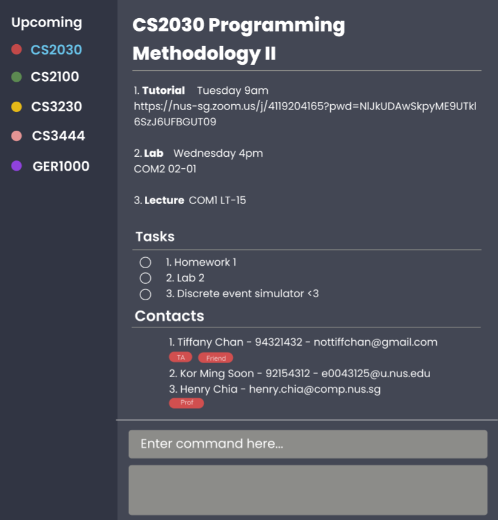

# TrackIt@NUS - User Guide

By: `Team W13-4` Since: `Aug 2020` License: `MIT`

## Table of Contents
1. [Introduction](#introduction)
2. [Quick Start](#quick-start)
3. [About](#about)
    1. [Common Symbols](#common-symbols)
    2. [Command Format](#command-format)
    3. [General explanation of how Commands work](#general-exp)
4. [Features](#features)
    1. [Module](#module)
    2. [Lesson](#lesson)
    3. [Task](#task)
    4. [Contact](#contact)
    5. [Search](#search)
    6. [Help](#help)
    7. [Exit](#exit)
5. [FAQ](#faq)
6. [Command Summary](#command-summary)
    1. [Module Commands](#module-commands)
    2. [Task Commands](#task-commands)
    3. [Lesson Commands](#lesson-commands)
    4. [Contact Commands](#contact-commands)
    5. [General Commands](#general-commands)

--------------------------------------------------------------------------------------------------------------------

## Introduction 

Welcome to the **TrackIt@NUS** user-guide!

Do you want to balance schoolwork and having a social life, but dislike having to use 3 different
 apps to keep track of everything? Then look no further! TrackIt@NUS is a one-stop solution for busy students like you
  and I.

TrackIt@NUS is a desktop app for managing modules, lessons, tasks, and contacts, tailored to the needs of NUS students and
  optimized for use via a **Command Line Interface (CLI)** while still having the benefits of a **Graphical User
   Interface (GUI)**. If you can type fast, you will be able to manage your academic and social commitments much faster
    than by using other traditional GUI apps.

What are you waiting for? Head on to [Section 2, **Quick Start**](#quick-start) to learn more!

## Quick start 

1. Ensure you have **Java 11** or above on your Computer.

1. Download the latest version of TrackIt@NUS from [here](https://github.com/AY2021S1-CS2103T-W13-4/tp/releases/tag/v1.2).

1. Copy the file to the folder you want to use as the home folder for TrackIt@NUS.

1. Double-click the file to start the app. The GUI shown below should appear in a few seconds.

1. You are now on the home page of TrackIt@NUS.

1. At the bottom of the screen, type your command in the Command Box (see [Features](#features) for more info) and
 press `Enter` on your keyboard to execute it.

## About 

### Common Symbols 

| Symbol | Description |
| --- | ----------- |
| :information_source: | Something important to take note of |
| :bulb: | A tip is being mentioned |
| :warning: | Something to be careful of |

### Command Format 

| **Format** | **Meaning** | **Example** |
| ----- | -------- | -------------- |
| `lower_case/` | These are **prefixes** and are used to separate the different parameters of a command | `n/`, `d/`, `t/` |
| `UPPER_CASE` | These are **parameters** and need to be supplied to complete certain commands | `C add n/John ...` |
| `[UPPER_CASE]` |  These are **optional parameters** | `C add n/John ...` or `C add n/John t/Friend ...` both work |
| `…`​ | These are parameters that can be used **multiple times** or **none at all** | `C add n/John t/Brother-in-law t/Colleague t/Friend ...` |

:information_source: Parameters can be in any order. e.g. if the command specifies `n/NAME p/PHONE_NUMBER`, `p/PHONE_NUMBER n/NAME` is also acceptable.

### General explanation of how Commands work 

:information_source: A **View** command will display all the relevant information about a certain module/lesson/task
/contact. Relevant parameters (see [Features](#features) for more info) must be present.

:information_source: An **Add** command will add a module/lesson/task/contact to TrackIt@NUS. Relevant parameters (see [Features](#features) for more info) must be present.

:information_source: An **Edit** command will edit a module/lesson/task/contact. Relevant parameters (see [Features
](#features) for more info) must be present. All parameters that are not specified will **remain unchanged**.

:information_source: A **Delete** command will delete a module/lesson/task/contact. Relevant parameters (see [Features](#features) for more info) must be present.

--------------------------------------------------------------------------------------------------------------------

## Features 

A sample of CS2030's module page in TrackIt@NUS. The relevant lessons, tasks, and contacts are all shown as well.

:information_source: Lessons, tasks, and contacts are all linked closely to a module

## Module 

### Add

For: Add a new module.

Format: `M add m/MODULE_CODE n/NAME`

Examples: `M add m/CS1231S n/Discrete Structures`

### Edit
For: Edit the module with the specified `MODULE_CODE`.

Format: `M edit m/MODULE_CODE [m/NEW_MODULE_CODE] [n/NAME]`

Examples: `M edit m/CS1231S m/CS1101S n/Programming Methodology`

Remark: The `MODULE_CODE` provided must be present in the Module list. At least 1
 field must be provided for editing. i.e. `M edit m/CS2100` is not allowed.

### Delete
For: Delete the module with the specified `MODULE_CODE`.

Format: `M delete m/MODULE_CODE`

Examples: `M delete m/CS2100`

Remark: The `MODULE_CODE` provided must be present in the Module list.

## Lesson 

### Add
For: Add a lesson to a module.

Format: `L add m/MODULE_CODE n/TYPE d/DATE a/LOCATION`

Examples: `L add m/CS2103T n/tutorial d/2pm - 3pm Wed a/COM1`

Remark: The module must exist prior to adding a lesson. `DATE` must be of the form `START_TIME - END_TIME DAY_OF_WEEK`.`TYPE` must be one of
 the following:
* `LEC` (for lecture)
* `TUT` (for tutorial)
* `LAB` (for laboratory)
* `SEC` (for sectional teaching)
* `REC` (for recitation)

### Edit

For: Edit the detail of a lesson

Format: `L edit INDEX [m/MODULE_CODE] [n/TYPE] [d/DATE] [a/LOCATION]`

Examples: `L edit 1 m/CS2103T n/tutorial d/2pm - 3pm Monday`

Remark: The `INDEX` provided must be positive and cannot be larger than the number of Lessons. At least 1
 field must be provided for editing. i.e. `L edit 1` is not allowed.

### Delete
For: Delete the lesson with the specified `INDEX`

Format: `L delete INDEX`

Examples: `L delete 1`

Remark: The `INDEX` provided must be positive and cannot be larger than number of Lessons.

## Task 

Managing all your tasks can be so stressful! TrackIt@NUS helps alleviate that stress with our built-in Task Manager
! To view all your tasks, simply click on the upcoming tab as shown below.

This sorts all your tasks by date. To view module-specific tasks, click on any of the module tabs as shown below.

:information_source: All module-specific tasks are shown in the upcoming tab, but not vice versa.

You can also perform commands on the tasks as explained below.

### Add

After a day of school you realise that you now have a few more tasks to complete and wish to keep track of them. This is
 the command for adding a new task to TrackIt@NUS. 

Format: `T add n/NAME d/DATE [m/MODULE_CODE] [r/REMARK]`

Examples: 

* `T add n/Assignment 1 m/CS2100 d/20/11/2020 r/Focus on Chapters 1-3`
* `T add n/Plan for Bob's birthday d/12/11/2020`
* `T add n/Buy mooncakes for Mum d/28/10/2020 r/Remember to get Durian-flavoured ones`

:information_source: The parameters `m/MODULE_CODE` and `r/REMARK` are optional

:warning: The `DATE` provided must be in the format `dd/MM/yyyy`

### Edit
After adding a task to TrackIt@NUS, you may want to change it, perhaps extend the deadline or change it's remark. The
 edit command is what you should use to do so.

Format: `T edit INDEX [n/NAME] [d/DATE] [m/MODULE_CODE] [r/REMARK]`

Examples: 

* `T edit 2 n/Work on midterm report` changes the name of the Task
* `T edit 2 r/min 1000 words` changes the remark of the Task
* `T edit 2 m/CS2100` changes the module code of the Task 

:information_source: The `INDEX` provided must be positive and cannot be larger than number of Tasks

:warning: At least 1 field must be provided for editing. i.e. `T edit 1` is not allowed

:bulb: Write `T edit 1 m/` to remove the module code from the task. Now, the task does not belong to any module

### Delete
Once you have completed a task, you can delete it. This is the command to do so.

Format: `T delete INDEX`

Examples: `T delete 2`

:information_source: The `INDEX` provided must be positive and cannot be larger than the number of Tasks

## Contact 

### Add

For: Add a new contact.

Format: `C add n/NAME p/PHONE_NUMBER e/EMAIL [t/TAG]...`

Examples:

* `C add n/John Doe p/98765432 e/jon@jon.com t/Brother`
* `C add n/Rajesh Kumar p/98762342 e/raj@law.com t/Friend`

### Edit

For: Edit the contact with the specified index.

Format: `C edit INDEX [n/NAME] [p/PHONE_NUMBER] [e/EMAIL] [t/TAG]...`

Examples:
* `C edit 1 n/Johnny Depp p/98999899`
* `C edit 2 n/Sam e/sam@gmail.com t/Colleague`

Remark: The `INDEX` provided must be positive and cannot be larger than the number of Contacts. At least 1
 field must be provided for editing. i.e. `C edit 1` is not allowed.

:warning: When editing tags, existing tags of contact will be removed (i.e. adding tags is not cumulative)

:bulb: Can remove all tags by typing t/ without any tags following it

### Delete

For: Delete the contact with the specified index.

Format: `C delete INDEX`

Examples: `C delete 1`

Remark: The `INDEX` provided must be positive and cannot be larger than the number of Contacts.

## Searching the app 

For: Searching the app for relevant modules, lessons, tasks, or contacts

Format: `find KEYWORD`

Examples: `find CS1101S`

## Getting help 

For: Getting help from the program.

Format: `help`

Examples: `help`

## Exiting the app 

For: Exit the program.

Format: `exit`

Examples: `exit`

## Saving the data

TrackIt@NUS data is saved in the hard disk automatically after any command that changes the data. There is no need to
 save manually.

--------------------------------------------------------------------------------------------------------------------

## FAQ 

**Q**: How do I transfer my data to another Computer? 
**A**: Install the app in the other computer and overwrite the empty data file it creates with the file that contains
 the data of your previous TrackIt@NUS home folder.

## Command Summary 

### Module 

| Command | Example |
| ---- | ------ |
| **Add:** `M add m/MODULE_CODE n/NAME` | `M add m/CS2100 n/Computer Organisation` |
| **Edit:** `M edit m/MODULE_CODE [m/NEW_MODULE_CODE] [n/NAME]` | `M edit m/CS1231S n/Discrete Mathematics` |
| **Delete:** `M delete m/MODULE_CODE` | `M delete m/CS1101S` |

### Task 

| Command | Example |
| ---- | ------ |
| **Add:** `T add n/NAME d/DATE [m/MODULE_CODE] [r/REMARK]` | `T add n/Assignment 1 d/20/11/2020 r/Focus on Chapters 1-3` |
| **Edit:** `T edit INDEX [n/NAME] [d/DATE] [m/MODULE_CODE] [r/REMARK]` | `T edit 1 n/Finish Assignment` |
| **Delete:** `T delete INDEX` | `T delete 1` |

### Lesson 

| Command | Example |
| ---- | ------ |
| **Add:** `L add m/MODULE_CODE n/TYPE d/DATE a/LOCATION` | `L add m/CS2103T n/tutorial d/2pm - 3pm Wed a/COM1` |
| **Edit:** `L edit INDEX [m/MODULE_CODE] [n/TYPE] [d/DATE] [a/LOCATION]` | `L edit 1 a/LT17` |
| **Delete:** `L delete INDEX` | `L delete 1` |

### Contact 

| Command | Example |
| ------ | ---------- |
| **Add:** `C add n/NAME p/PHONE_NUMBER e/EMAIL [t/TAG]...` | `C add n/John Doe p/98765432 e/jon@jon.com t/Brother` |
| **Edit:** `C edit INDEX [n/NAME] [p/PHONE_NUMBER] [e/EMAIL] [t/TAG]...` | `C edit 1 n/Johnny Depp p/98999899` |
| **Delete:** `C delete INDEX` | `C delete 1` |

### General 

| Command | Example |
| ---- | ------ |
| **Help:** `help` | `help` |
| **Exit:** `exit` | `exit` |
