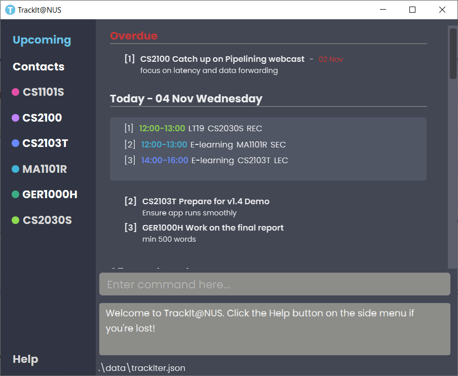
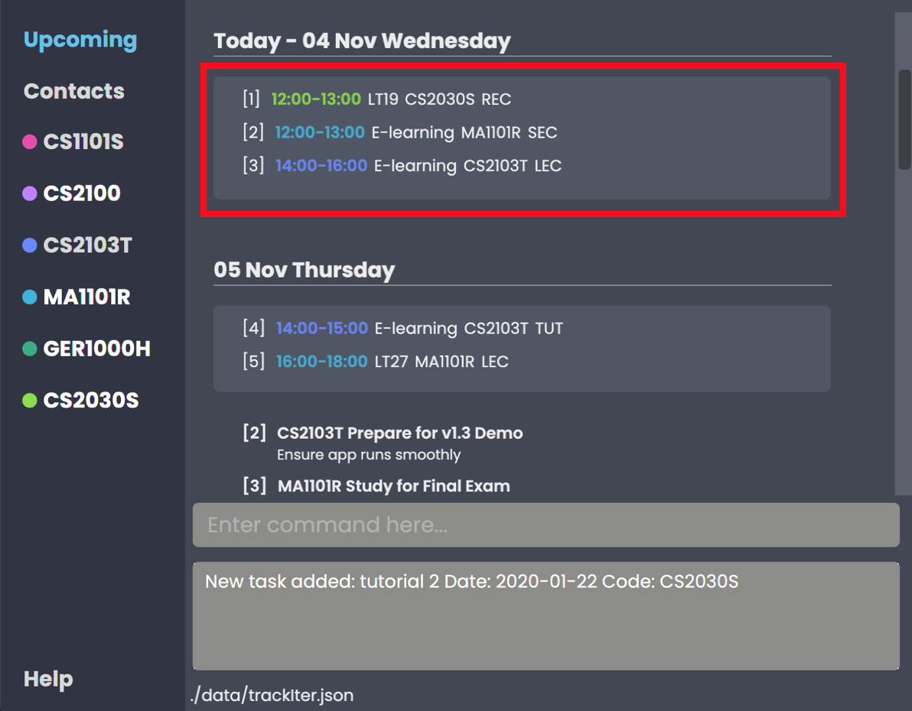
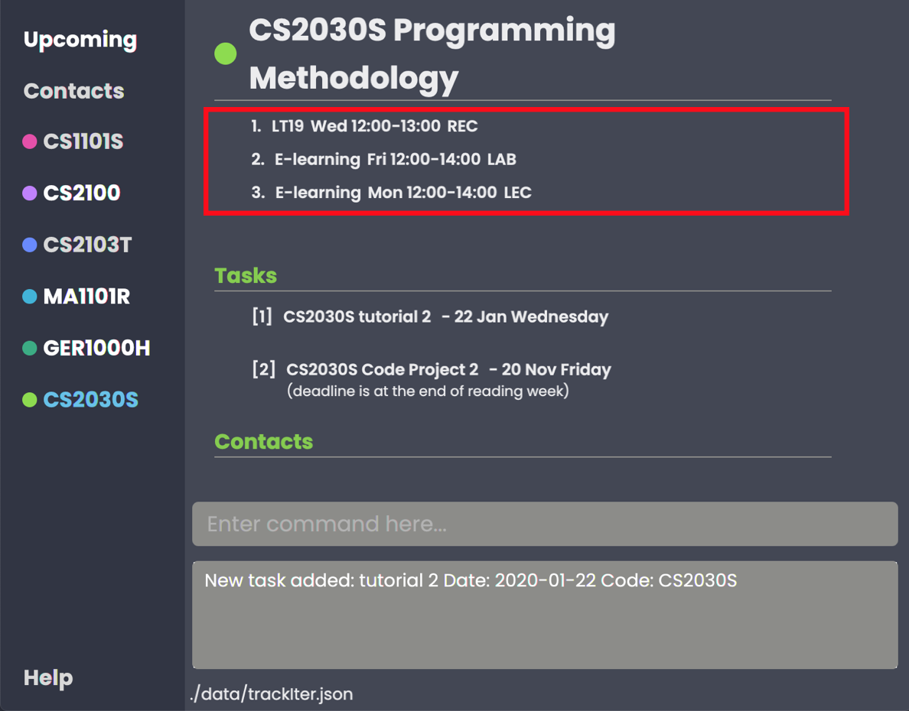

# TrackIt@NUS - User Guide

By: `Team W13-4` Since: `Aug 2020` License: `MIT`

## Table of Contents
1. [Introduction](#introduction)
2. [Quick Start](#quick-start)
3. [About](#about)
    * 3.1 [Common Symbols](#common-symbols)
    * 3.2 [Command Format](#command-format)
    * 3.3 [Duplicate Parameters](#duplicate-parameters)
4. [Application Layout](#layout)
    * 4.1 [Upcoming Tab](#upcomingtab)
    * 4.2 [Module Tabs](#moduletabs)
    * 4.3 [Contacts Tab](#contactstab)
    * 4.4 [Help Tab](#helptab)
    
5. [Features](#features)
    * 5.1 [Module](#module)
    * 5.2 [Lesson](#lesson)
    * 5.3 [Task](#task)
    * 5.4 [Contact](#contact)
    * 5.5 [Help](#help)
    * 5.6 [Exit](#exit)
6. [FAQ](#faq)
7. [Glossary](#glossary)
8. [Command Summary](#command-summary)
    * 7.1 [Module Commands](#module-commands)
    * 7.2 [Lesson Commands](#lesson-commands)
    * 7.3 [Task Commands](#task-commands)
    * 7.4 [Contact Commands](#contact-commands)
    * 7.5 [General Commands](#general-commands)

--------------------------------------------------------------------------------------------------------------------

## 1. Introduction 

Welcome to the **TrackIt@NUS** user-guide!

Do you struggle having to use multiple apps to balance your school life? Do you waste precious time just trying
 to find the information you need in the many apps you use? Well, look no further. Our application, TrackIt@NUS is an
  all-in-one solution for a busy student like you to manage and organize your life, helping you to *Track Less, and
   Live More.*

TrackIt@NUS is a desktop app for managing modules, lessons, tasks, and contacts, tailored to the needs of NUS students and
  optimized for use via a [**Command Line Interface (CLI)**](#glossary) while still having the benefits of a
   [**Graphical User Interface (GUI)**](#glossary). If you can type fast, you will be able to manage your academic
    and social commitments much more efficiently than by using other traditional GUI apps.

What are you waiting for? Head on to [Section 2, **Quick Start**](#quick-start) to learn more

## 2. Quick Start 

1. Ensure you have **Java 11** or above on your Computer. You may install it [here](https://www.oracle.com/java/technologies/javase-jdk11-downloads.html).

1. Download the latest version of TrackIt@NUS from [here](https://github.com/AY2021S1-CS2103T-W13-4/tp/releases).

1. Copy the file to the folder you want to use as the home folder for TrackIt@NUS.

1. Double-click the file to start the app. A GUI similar to Figure 1 shown below should appear in a few seconds. You
 are now on the main page of TrackIt@NUS.
Note how the app contains some sample data.   

  _Figure 1 - GUI of TrackIt@NUS_

At the bottom of the screen, type your command in the Command Box and press `Enter` on your keyboard to execute it
. Try typing `help` and pressing `Enter` to navigate to the Help Tab! 
 
For details on the commands you can use, please refer to [Section 5 - Features](#features).

## 3. About 

There are many things you can use TrackIt@NUS for. We have structured this document so it is easy for you to find
 what you need. In the [Common Symbols](#common-symbols), [Command Format](#command-format), and [Commands and their
  Purposes](#command-purpose) sections, you will find useful tips on reading this document. It is
  then followed by the [Features](#features) section, where the main features of TrackIt@NUS are documented.

### 3.1 Common Symbols 

| Symbol | Description |
| --- | ----------- |
| :information_source: | This symbol indicates that something important to take note of. |
| :bulb: | This symbol indicates that a tip is being mentioned. |
| :warning: | This symbol indicates something to be careful of. |

### 3.2 Command Format 

Since **TrackIt@NUS** is a *CLI* application, knowing how to use commands is important. This following section shows you how to interpret and use commands in the app. All commands follow similar formats as outlined below and examples will be provided to help you understand their usage. Examples of commands and their formats will be written in `code-blocks`.

The table below explains some important technical terms. An example will be provided to help you visualize these terms.
| **Technical Term** | **Explanation** |
| ------------------ | --------------- |
| Command type | Depending on whether you are dealing with a Module, Task, Lesson or Contact, the type is `M`, `T`, `L` or `C` respectively. |
| Command word | The first word of the command. It determines the action the app should carry out. |
| Parameter | The word or group of words following the command word. They are values given to a command to perform the specified action. |
| Prefix | 	The word that at the start of a parameter. It distinguishes one parameter from another.|

 Example: `M add m/CODE n/MODULE_NAME` 
 Breakdown: 
* **Command type** - `M` 
* **Command word** - `add` 
* **Parameters** - `CODE` and `MODULE_NAME` 
* **Prefix** - `m/`, `n/` 

The following table explains how you can use a command with the provided format. More examples will be provided for each command in [Section 5, Features](#features). Words in the upper case are the parameters to be supplied by you.

| **Format** | **Meaning** | **Example** |
| ----- | -------- | -------------- |
| `lower_case/`  A lower case letter, followed by a forward slash | These are **prefixes**.  They are used to separate the different parameters of a command. | `n/`, `d/`, `t/`  Note that prefixes **cannot have spaces**: `n /` is **not** a prefix, and will not be recognized. |
| `UPPER_CASE`  Words in upper case | These are **parameters**.  They need to be supplied to complete certain commands | To create a new **contact** with the name **John**, we use the `add contact` command.  Suppose the `add contact` command looks like this: `C add n/NAME`  Simply replace `NAME` with `John` to create John's contact: `C add n/John` |
| `[UPPER_CASE]`  Words in upper case, surrounded by square brackets |  These are **optional parameters** and need not be included for some commands.| Suppose a command contains two parameters: `n/NAME [t/TAG]`  The **first parameter** `NAME` is **compulsory**. The **second parameter** `TAG` is **optional**.  Since a `TAG` is optional, both of these commands are valid:  <ul><li>`C add n/John`</li><li>`C add n/John t/Friend`</li></ul>|
| `UPPER_CASE…`  `[UPPER_CASE]...`  An ellipsis `...` following any words in upper case | These are parameters that can be used **multiple times** or **none at all**. | The following parameter can be used **multiple times**: `t/TAG...`  This means that it can be: <ul><li>**Left empty**</li><li>**Used one time**: `t/friend`</li><li>**Used multiple times: `t/friend t/groupmate`</li></ul> |

:information_source: Parameters can be in any order. e.g. if the command specifies `n/NAME p/PHONE_NUMBER`, `p/PHONE_NUMBER n/NAME` is also acceptable.
 

### 3.3 Duplicate Parameters 
You can specify the same parameter more than once in a command. Depending on the command, you will receive different
 outcomes:
 
 | **Parameter** | **Explanation** | **Example** |
 | -------------| ---------------- | ----------- |
 |Could be used multiple times| **All occurrences** will be used when executing the command|In the `add contact`command, you can create a contact with **multiple tags.**  You can input multiple tags by chaining them: `t/CS1101S t/TA`  This will give a contact these tags.|
 | Can only be used once | Only the **last occurrence** will be used when executing the command. | On executing `M add m/CS2103T n/Favourite Mod n/Software Engineering`, you will create a module with the name `Software Engineering`, and the name `SE` will be ignored. | 

--------------------------------------------------------------------------------------------------------------------
## 4. Application Layout 

This section is gives you a **brief overview** of the **layout** of TrackIt@NUS, and this will help you **get used** to our interface in **a matter of minutes**!

_Figure 2 - Layout of TrackIt@NUS_

TrackIt@NUS is mainly divided into **four** carefully designed `tabs`:
* The `Upcoming tab` 
* The `Contacts tab`
* The various `Module tabs` 
* The `Help tab`

The `Side panel` on the left section allows you to **easily navigate** between the `tabs`. When you switch to a different `tab`, the new `tab` will be highlighted in **blue** in the `Side panel`. To run a command, simply type a command in the `Command box` and TrackIt@NUS will inform you about the outcome in the `Result display`.

### 4.1 Upcoming Tab 
Built with a **clean UI**, the `Upcoming tab` is what you will see when you first run TrackIt@NUS! You get to see an **overview** of all your **upcoming lessons** for the week, as well as the **list of tasks that are due soon**. With the `Upcoming tab`, you don't have to worry about missing any lessons or deadlines anymore!

_Figure 3 - Layout of Upcoming Tab_

In the `Upcoming tab`, there are **three** main `sections` arranged in **chronological order**:
1. The `Overdue section` is coloured **red &#x1F534;  to warn** you that about the **incomplete tasks** that are **past their deadline**. These tasks will remain there until you delete them, so remember to complete them as soon as possible!

2. The next seven `Daily sections` shows the your **Lessons** and **Tasks** daily for the **next seven days**. This is where you can start planning your schedule for the day.

3. The `Future section` shows the **Tasks** that are only due **at least 7 days later**, so these are tasks that you don't have to worry too much about for now.

### 4.2 Module Tabs 
Besides the `Upcoming tab`, the `Module tab` is another **highlight** that you can look forward to! This is an **all-in-one page** with all the details that you will need when **studying for a specific module**. With this, you don't have to waste precious time toggling between your calender, to-do list and contacts app anymore!
 
 
 _Figure 4 - Layout of Module Tab_
 
The `Module tab` includes `Lessons`, `Tasks` and `Contacts` that are related to this module.
 
1. `Lessons`: List of **lessons** for this module.

2. `Tasks`: List of **tasks** in **chronological** order. *Tips: Don't leave tutorials or assignments until the last day, chances are you not gonna finish it!*

3. `Contacts`: List of **relevant contacts** for this module. Here's where you can **find help** if u have difficulties with your assignments!
 
 :information_source: Want to know more details about [Lessons](#lesson), [Tasks](#task) and [Contacts](#contact)? Simply click on the respective links!
 
### 4.3 Contacts Tab 
So you might ask, why is there a need for the `Contacts tab` when I can add `contacts` in the `Module tab`? Well, the **beauty** of the `Contacts tab` is that you can add people who may **not be taking the same modules** as you but they are **still relevant** in your social life and/or school life! In this way, you can still include **other useful contacts** in TrackIt@NUS. How cool is that?

_Figure 5 - Layout of Contacts Tab_

 :information_source: More details about `contacts` can be found [here](#contact).
 
 ### 4.4 Help Tab 
 Feeling **lost**? If you are **lazy** to spend time looking through this long and detailed user guide to find **a single command**, here's an extra bonus for you! This `Help tab` gives you a **quick summary** of the commands that you can use. This way, you can fire multiple commands in **a matter of seconds** and you can be one step closer to **productivity**! 
 

_Figure 6 - Layout of Help Tab_

--------------------------------------------------------------------------------------------------------------------
## 5. Features 

This section contains all the information you need to know about the features of **TrackIt@NUS**. To use each feature or
 sub-feature, you will need to enter the command into the Command Box.

## 5.1 Module 
Module is the first thing you need to create when you start using the app, because each module will house its own lessons, tasks and related contacts. So, let's find out how to create a new module! 

### 5.1.1 Module Command Parameters
Here are the parameters used in the Module feature:
| **Parameter** | **Description** | **Example** |
| --------------| ----------------| ----------- |
| `CODE`| Refers to the unique code given to the module.  You can personalise this and give it your own code. However, we recommend you use the module’s official code. | **CS2103T** |
| `NAME`| Refers to the **Module** name. | **Software Engineering** |

### 5.1.2 Add

You can use this command to create a new Module (Or a new category of things to worry about).

Format: `M add m/CODE n/NAME`

Example: To add the Module CS1231 Discrete Structures into TrackIt@NUS, follow these instructions.
| **Parameter** | |
| ------------|-|
| `CODE` | CS1231 |
| `NAME` | Discrete Structures |

1. To add, type `M add m/CS1231S n/Discrete Structures` into the command box
2. Press `Enter` to execute.
3. The Result Display will show the success message and you will see your new module in the side panel.

_Figure 7 - Example outcome of adding a module_

### 5.1.3 Edit
Because modules are displayed only on the side panel, they are not indexed. That's why to edit and delete a module, its code will be used instead! This is how to edit a module's code and/or name:

Format: `M edit CODE [m/NEW_CODE] [n/NAME]`

:information_source: Note:
* The `CODE` provided must be present in the Module list.

Example: If you have spelt a module CS1231's name wrongly and wish to change it to the correct spelling `Discrete Structures`, follow these instructions.
1. Type `M edit CS1231 n/Discrete Structures` into the Command Box
2. Press `Enter` to execute
3. The Result Display will show a success message and you will be able to view the correct module name in the corresponding module tab.

_Figure 8 - Example outcome of editing a module_

### 5.1.4 Delete
And what if you realized you accidentally added in a wrong module, or have finished one? Just delete that module! The
 command's syntax is as follows: 

Format: `M delete CODE`

:information_source: Note: 
* When you delete a module, the contacts associated with that module will **not** be deleted. The tag will also **not** be edited in any way.
* When you delete a module, the app will delete all of its related tasks & lessons, so check twice before you delete it! 

To delete the module `CS2100`:
1. Type `M delete CS2100` into the Command Box
2. Press `Enter` to execute
3. The Result Display will show a success message and the module tab will be removed from the side panel.

_Figure 9 - Example outcome of deleting a module_

## 5.2 Lesson 
Lectures, tutorials, labs, lectures, lectures, recitations, lectures... Sometimes, just looking at your crowded timetable makes you question your life choices. 

While TrackIt@NUS can't do much to make those lessons disappear, it can, at the very least, make sure you won't miss any of them!

To view all your lessons (classes) for the next week, simply click on the upcoming tab, which sorts your lessons by day, and you will see something like the screenshot below, with lessons in the red outline.

_Figure ? - Lessons in upcoming tab_

To view the lessons of a specific module, click on any of the module tabs and you will see something like the screenshot below, with lessons in the red outline.

_Figure ? - Lessons in module tab_

:information_source: As of v1.3, only weekly lessons are supported. Biweekly and monthly lessons may be added in subsequent versions.

You can also perform commands on the lessons as explained below.

### 5.2.1 Lesson Command Parameters
Here are the parameters used in the Module feature:
| **Parameter** | **Description** | **Example** |
| --------------| ----------------| ----------- |
| `INDEX` | Indicates the position of an item in a list. The specified `INDEX` must be **within the range** of the number of items in the list. | **1** - refers to the first item in a list |
| `CODE`| Refers to the unique code given to the module.  You can personalise this and give it your own code. However, we recommend you use the module’s official code. | **CS2103T** |
| `TYPE` | Refers to the type of lesson.| **lecture/lec** - lecture  **tutorial/tut** - tutorial  **laboratory/lab** - laboratory  **recitation/rec** - recitation  **sectional/sec** - sectional |
| `DATE` | Indicates the weekly timing of a lesson. Must be in `ddd H:mm-H:mm` and 24-hour time format. | **mon 12:00-14:00** |
| `ADDRESS` | Indicates where a lesson is held. | **COM1-0215** |

:warning: The time slots of the lessons _can_ overlap. It's a situation that no one wants to be in, but, unfortunately, does sometimes happen.

### 5.2.2 Add
The command that makes you sigh every time you have to use it. Use this command to add a lesson to a module.

Format: `L add m/CODE t/TYPE d/DATE a/ADDRESS`

:information_source: Note:
* You must create the Module first before you can add a lesson with that module code.

Example: To add MA1101R tutorial in COM1-0121 that falls every Monday from 4-6pm, follow these instructions.
| **Parameter** | |
|---------------|-|
| CODE| **MA1101R**|
|TYPE| **tutorial/tut**|
|DATE| **Mon 16:00-17:00** |
| ADDRESS | COM1-0121|

 1. To add, type `L add m/MA1101R t/tutorial d/MON 16:00-17:00 a/COM1-0121` into the command box.
 2. Press `Enter` to execute.
 3. The Result Display will show the success message and you should see your new lesson in the Upcoming tab as well as the MA1101R module tab.

(TODO: ADD LESSON OUTCOME)
_Figure ? - Example outcome of adding a lesson_

_Figure 10 - Example outcome of adding a lesson_

### 5.2.3 Edit

After adding a lesson, you might still want to change its details. 
This is the command to do so.

Format: `L edit INDEX [m/CODE] [t/TYPE] [d/DATE] [a/ADDRESS]`

:information_source: Note:
 The parameters `m/CODE`, `t/TYPE`, and `d/DATE` are optional;
however, at least one parameter must be provided (i.e. `L edit 1` is not a valid command).

Example: To change the lesson timing to 5pm-6pm, follow these instructions. 
| **Parameter** | |
|---------------|-|
| INDEX | 1|
|DATE| **Mon 17:00-18:00** |

 1. Look for the lesson's index which is on the left of the lesson.
 2. To add, type `L edit 1 d/MON 17:00-18:00` into the command box.
 3. Press `Enter` to execute.
 4. The Result Display will show the success message and you should see your lesson updated in the Upcoming tab as well as the MA1101R module tab.

_Figure 11 - Example outcome of editing a lesson_

### 5.2.4 Delete
Sometimes, you might want to delete a particular lesson, probably since you've added it by mistake, or you hate it so much you want to forget its existence. This is the command to do so.

Format: `L delete INDEX`

Example: To delete a lesson, follow these instructions.

 1. Look for the lesson's index which is on the left of the lesson.
 2. Type `L delete 1` into the command box.
 3. Press `Enter` to execute.
 4. The Result Display will show a success message and you should see your lesson disappear.

(TODO: ADD DELETE LESSON OUTCOME)
_Figure ? - Example outcome of deleting a lesson_

_Figure 12 - Example outcome of deleting a lesson_

## 5.3 Task 

Managing all your tasks can be so stressful! TrackIt@NUS helps alleviate that stress with our built-in Task Manager
! To view all your tasks, simply click on the upcoming tab as shown below.

This sorts all your tasks by date. To view module-specific tasks, click on any of the module tabs as shown below.

:information_source: All module-specific tasks are shown in the upcoming tab, but not vice versa.

You can also perform commands on the tasks as explained below.

### 5.3.1 Task Command Parameters
Here are the parameters used in the Task feature:
| **Parameter** | **Description** | **Example** |
| --------------| ----------------| ----------- |
| `INDEX` | Indicates the position of an item in a list. The specified `INDEX` must be **within the range** of the number of items in the list. | **1** - refers to the first item in a list |
| `CODE`| Refers to the unique code given to the module.  You can personalise this and give it your own code. However, we recommend you use the module’s official code. | **MA1101R** |
| `NAME`| Refers to the **Task** name | **Assignment 1** |
| `DATE` | Indicates the date of a task deadline. Must be in `dd/mm/yyyy` format. | **01/01/2021** |
| `REMARK` | Refers to any (optional) additional remarks for a task. | For a task `Assignment 1`, a possible remark could be `Focus on Chapters 1-3` |

### 5.3.2 Add

After a day of school you realise that you now have a few more tasks to complete and wish to keep track of them. This is
 the command for adding a new task to TrackIt@NUS.

Format: `T add n/NAME d/DATE [m/CODE] [r/REMARK]`

Example: To add a task "MA1101R Assignment 1 due on 1 November 2020, covering Chapters 1-3" into TrackIt@NUS, follow these instructions.
| **Parameter** | |
| ------------- | - |
| NAME| Assignment 1 |
| DATE | 01/11/2020 |
| Optional: [CODE]| MA1101R |
| Optional: [REMARK] | Focus on Chapters 1-3 |

 1. To add, type `T add n/Assignment 1 m/MA1101R d/01/11/2020 r/Focus on Chapters 1-3` into the command box.
 2. Press `Enter` to execute.
 3. The result display will show the success message and you will see your new task in the Upcoming tab, and its corresponding module tab (if CODE field was filled).

:warning: The `DATE` provided must be in the format `dd/MM/yyyy`.

:bulb: To give users greater freedom when adding tasks, you **can** add tasks with deadlines in the past.

_Figure 13 - Example outcome of adding a task_

### Edit
After adding a task to TrackIt@NUS, you may want to change it, perhaps extend the deadline or change it's remark. The
 edit command is what you should use to do so.

Format: `T edit INDEX [n/NAME] [d/DATE] [m/CODE] [r/REMARK]`

Examples:

* `T edit 2 n/Work on midterm report` changes the name of the Task
* `T edit 2 r/min 1000 words` changes the remark of the Task
* `T edit 2 m/CS2100` changes the module code of the Task

_Figure 14 - Example outcome of editing a task_

:information_source: Here, `INDEX` refers to the index of the task you want to edit, as shown in the current tab. The
 `INDEX` provided must be one of the task indexes shown in the current window.

:warning: At least 1 field must be provided for editing (i.e. `T edit 1` is not allowed).

:bulb: Write `T edit 1 m/` to remove the module code from the task. Now, the task does not belong to any module. You
 can also use `T edit 1 r/` to remove the remark from the task.
 
:bulb: To give users greater freedom when adding tasks, you **can** add tasks with deadlines in the past.

### Delete
Once you have completed a task, you can delete it. This is the command to do so.

Format: `T delete INDEX`

Examples: `T delete 2`

_Figure 15 - Example outcome of deleting a task_

:information_source: Here, `INDEX` refers to the index of the task you want to delete, as shown in the current tab. The
 `INDEX` provided must one of the task indexes shown in the current window.

## 5.4 Contact 
Don't you hate it when you need help for one of your modules but you just can't remember who else is taking the module with you? 

Luckily for you, TrackIt@NUS allows you to tag your contacts with the modules you have in common, and lets you see those contacts all at once! Simply click on a [module tab](#moduletabs) and you will find the list of contacts associated with that module.

To view all contacts from all modules, as well as any contacts that are not associated with any module, click on the [**Contacts** tab](#contactstab) in the side panel.

### 5.4.1 Contact Command Parameters
Here are the parameters used in the Contact feature:
| **Parameter** | **Description** | **Example** |
| --------------| ----------------| ----------- |
| `INDEX` | Indicates the position of an item in a list. The specified `INDEX` must be **within the range** of the number of items in the list. | **1** - refers to the first item in a list |
| `NAME`| Refers to the **Contact** name. | **John Doe** |
| `[PHONE_NUMBER]` | (Optional) Refers to the phone number of a contact. Phone numbers must consist of only numbers, and can be of any length. | **999** |
| `[EMAIL]` | (Optional) Refers to the email address of a contact. Emails should be in the format `local-part@domain`.  The `local-part` can only contain:<ul><li>Alphanumeric characters, and</li><li>The following special characters: `!#$%&'*+-/=?^_{}~`</li></ul>  The `domain` can only contain: <ul><li>At least 2 characters</li><li>Alphanumeric characters</li><li>The following special characters in between: dash `-`, and period `.`</li><li>Start and end must be alphanumeric characters</li></ul> |**johnDoe925@example.com**|
| `[TAG]` | (Optional) Tags are a way to group any number of contacts under a similar label. You can add as many tags as you want. Tagging a contact with a `CODE` will allow you to view the contact under the corresponding module tab.  Note: if the provided module code doesn't exist, the tag will just be treated as another ordinary tag without any problems.| `n/John Doe t/MA1101R t/groupmate` |

### Add
A new semester has started and you want to keep track of your new classmates. This is the command to add a new contact.

Format: `C add n/NAME [p/PHONE_NUMBER] [e/EMAIL] [t/TAG]...`

:information_source: Note:
* Duplicate email addresses (2 or more contacts with the same email address) can exist within TrackIt@NUS, so please always ensure that you are entering the correct email address. 

Examples: To add a new contact John Doe, your MA1101R TA, follow these instructions.
| **Parameter** | |
| ------------- | - |
| NAME| John Doe |
| PHONE_NUMBER | 98765432 |
| EMAIL| johndoe@gmail.com |
| TAG | MA1101R, TA |

 1. To add, type `C add n/John Doe p/98765432 e/johndoe@gmail.com t/MA1101R t/TA` into the command box.
 2. Press `Enter` to execute.
 3. The result display will show the success message and you will see your new contact in the Contacts tab, and the MA1101R tab (if CODE field was filled).

_Figure 16 - Example outcome of adding a contact_

### Edit
After adding your new contact John Doe to TrackIt@NUS, maybe you realised you spelled his name wrong, or you want to update his phone number. The edit command is what you should use to do so.

Format: `C edit INDEX [n/NAME] [p/PHONE_NUMBER] [e/EMAIL] [t/TAG]...`

:information_source: Note:
* The parameters `n/NAME`, `p/PHONE_NUMBER`, `e/EMAIL` and `t/TAG` are optional;
however, at least one parameter must be provided (i.e. `C edit 1` is not a valid command).
* When editing tags, existing tags of contact will be removed (i.e. adding tags is not cumulative).
* All tags can be removed by typing `t/`

Example: To change John Doe's name to Johnny Depp, follow these instructions.
| **Parameter** | |
|---------------| - |
| INDEX | 2 |
| NAME | **Johnny Depp** |

 1. Look for the lesson's index which is on the left of the lesson.
 2. To add, type `C edit 2 n/Johnny Depp` into the command box.
 3. Press `Enter` to execute.
 4. The Result Display will show the success message and you should see your lesson updated in the Upcoming tab as well as the MA1101R module tab.

_Figure 17 - Example outcome of editing a contact_

### Delete
Congratulations! You have finished reading the module MA1101R and now wish to delete your TA Johnny Depp's contact from TrackIt@NUS. This is the command to do so.

Format: `C delete INDEX`

Examples: To delete Johnny Depp's contact, follow these instructions.

 1. To add, type `C edit 2 n/Johnny Depp` into the command box.
 2. Press `Enter` to execute.
 3. The Result Display will show the success message and you should see Johnny Depp's contact disappear from both the Contacts tab and MA1101R tab.

_Figure 18 - Example outcome of deleting a contact_

## Getting help 

For: Navigating to the [help tab](#helptab) for a command summary list.

Format: `help`

Examples: `help`

## Exiting the app 

For: Exit the program.

Format: `exit`

Examples: `exit`

## Saving the data

TrackIt@NUS data is saved in the hard disk automatically after any command that changes the data. There is no need to
 save manually.

--------------------------------------------------------------------------------------------------------------------

## 6. FAQ 

**Q: How do I transfer my data to another Computer?**
 A: Install the app in the other computer and overwrite the empty data file it creates with the file that contains
 the data of your previous TrackIt@NUS home folder.

**Q: Why can I add a `lesson` that clashes with my existing `lessons`? Is this a bug?**
 A: This is because there are instances where students are granted **a case-by-case approval** to overload modules with **concurrent lessons**. These students should have the option to include concurrent lessons. 
 
**Q: Why is there a need for the `Contacts Tab` when I can already add `contacts` in the `Module Tab`?**
 A: It is meant for you to add `contacts` that **may not be taking** the same modules as you but they are **still relevant** in your social life and/or studies. Please refer to the [Contacts Tab](#contactstab) for more details.

## 7. Glossary 

**Command Line Interface**: Known in short as **CLI**, the command line interface is a **text-based** user interface to
 view and manage computer files. Click [here](https://en.wikipedia.org/wiki/Command-line_interface) for more
  information!
 
**Graphical User Interface**: Known in short as **GUI**, the graphical user interface is a system of interactive
 visual components for computer software. Click [here](https://en.wikipedia.org/wiki/Graphical_user_interface) for
  more information!

## 8. Command Summary 

### Module 

| Command | Format | Example |
| -- | -------- | -------- |
| **add** | `M add m/MODULE_CODE n/NAME` | `M add m/CS2100 n/Computer Organisation` |
| **edit**| `M edit MODULE_CODE [m/NEW_MODULE_CODE] [n/NAME]` | `M edit CS1231 n/Discrete Structures` |
| **delete** | `M delete MODULE_CODE` | `M delete CS1101S` |

### Lesson 

| Command | Format | Example |
| -- | ------ | ------ |
| **add** | `L add m/MODULE_CODE t/TYPE d/DATE a/ADDRESS` | `L add m/CS2103T t/tutorial d/Wed 14:00-15:00 a/COM1` |
| **edit** | `L edit INDEX [m/MODULE_CODE] [t/TYPE] [d/DATE] [a/ADDRESS]` | `L edit 1 a/LT17` |
| **delete** | `L delete INDEX` | `L delete 1` |

### Task 

| Command | Format | Example |
| -- | ------ | ------ |
| **add** | `T add n/NAME d/DATE [m/MODULE_CODE] [r/REMARK]` | `T add n/Assignment 1 d/20/11/2020 r/Focus on Chapters 1-3` |
| **edit** | `T edit INDEX [n/NAME] [d/DATE] [m/MODULE_CODE] [r/REMARK]` | `T edit 1 n/Finish Assignment` |
| **delete** | `T delete INDEX` | `T delete 1` |

### Contact 

| Command | Format | Example |
| -- | ------ | ------ |
| **add** | `C add n/NAME p/PHONE_NUMBER e/EMAIL [t/TAG]...` | `C add n/John Doe p/98765432 e/jon@jon.com t/Brother t/Friend` |
| **edit** | `C edit INDEX [n/NAME] [p/PHONE_NUMBER] [e/EMAIL] [t/TAG]...` | `C edit 1 n/Johnny Depp p/98999899` |
| **delete** | `C delete INDEX` | `C delete 1` |

### General 

| Command | Format |
| ---- | ------ |
| **help** | `help` | `help` |
| **exit** | `exit` | `exit` |
