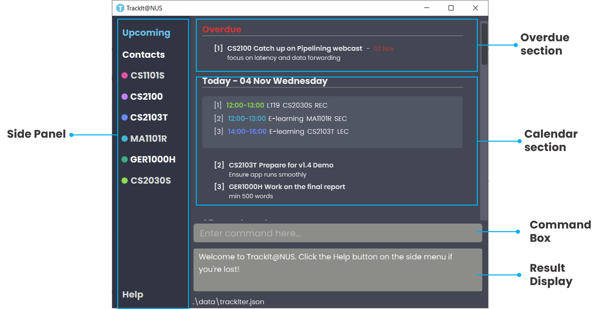
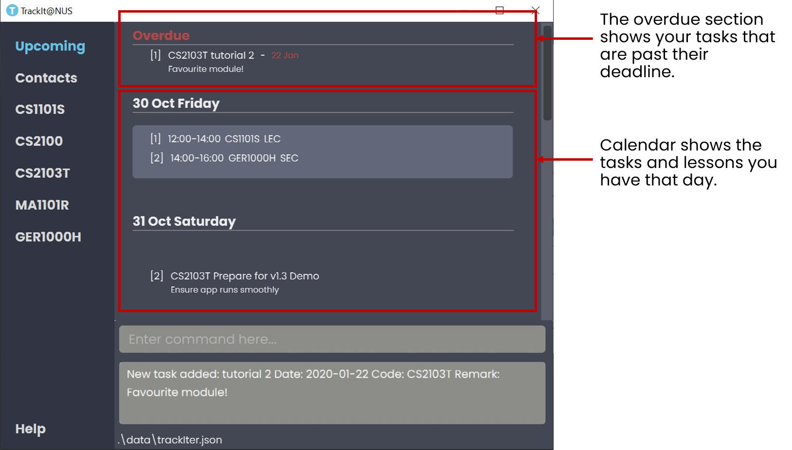
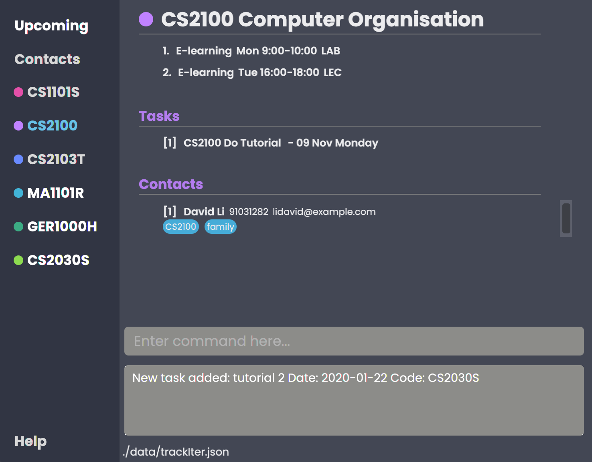
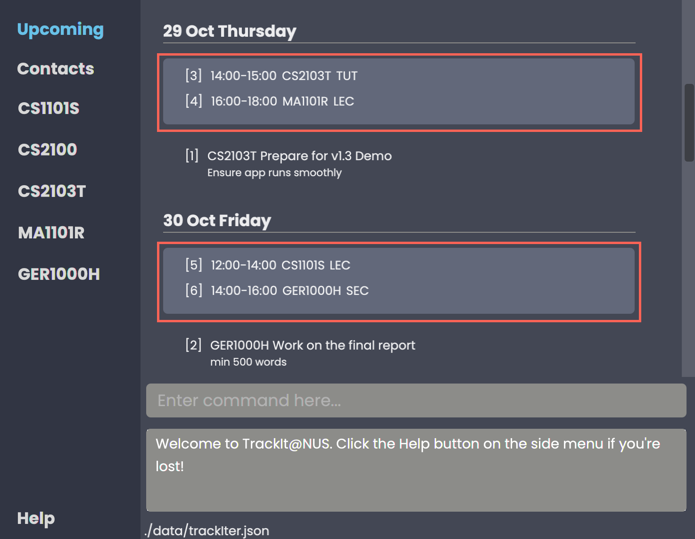
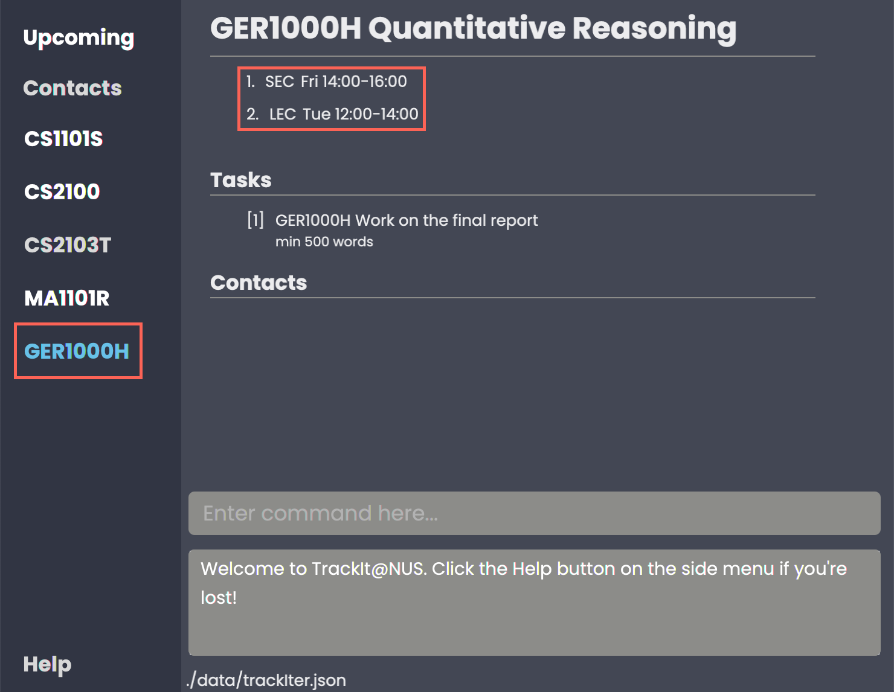
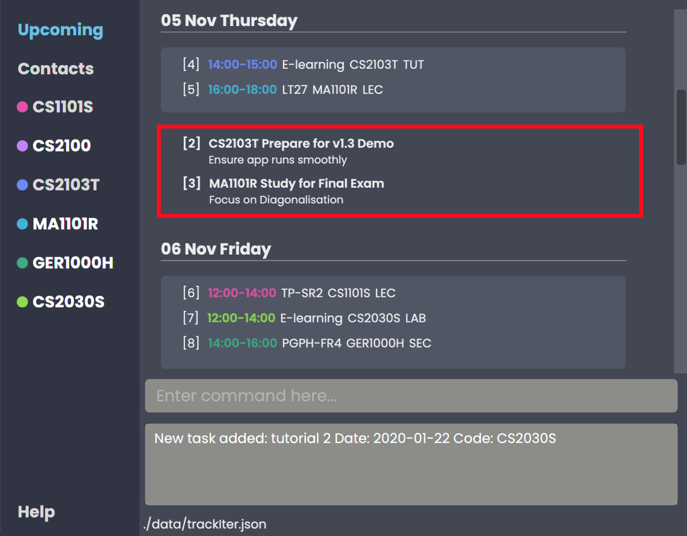
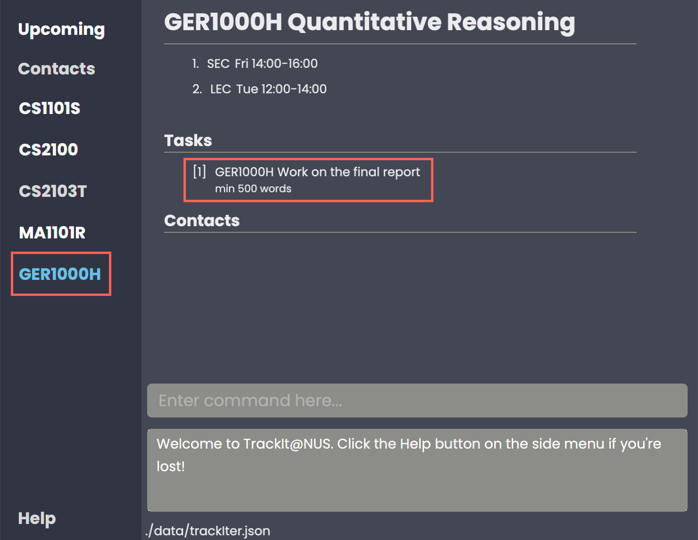
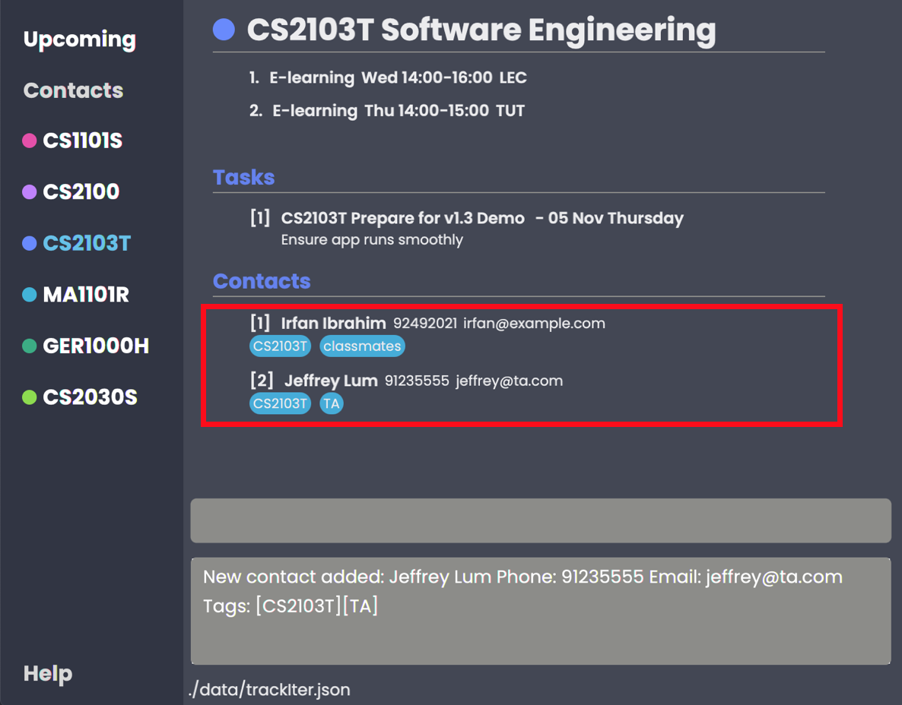

# TrackIt@NUS - User Guide

By: `Team W13-4` Since: `Aug 2020` License: `MIT`

## Table of Contents
1. [Introduction](#introduction)
2. [Quick Start](#quick-start)
3. [About](#about)
    1. [Common Symbols](#common-symbols)
    2. [Command Format](#command-format)
    3. [Duplicate Parameters](#duplicate-parameters)
4. [Layout](#layout)
    1. [Upcoming Tab](#upcomingtab)
    2. [Contacts Tab](#contactstab)
    3. [Module Tabs](#moduletabs)
5. [Features](#features)
    1. [Module](#module)
    2. [Lesson](#lesson)
    3. [Task](#task)
    4. [Contact](#contact)
    5. [Help](#help)
    6. [Exit](#exit)
6. [FAQ](#faq)
7. [Glossary](#glossary)
7. [Command Summary](#command-summary)
    1. [Module Commands](#module-commands)
    2. [Lesson Commands](#lesson-commands)
    3. [Task Commands](#task-commands)
    4. [Contact Commands](#contact-commands)
    5. [General Commands](#general-commands)

--------------------------------------------------------------------------------------------------------------------

## 1. Introduction 

Welcome to the **TrackIt@NUS** user-guide!

Do you struggle having to use multiple apps to balance your school life? Do you waste precious time just trying
 to find the information you need in the many apps you use? Well, look no further. Our application, TrackIt@NUS is an
  all-in-one solution for a busy student like you to manage and organize your life, helping you to **Track Less, and
   Live More.**

TrackIt@NUS is a desktop app for managing modules, lessons, tasks, and contacts, tailored to the needs of NUS students and
  optimized for use via a [**Command Line Interface (CLI)**](#glossary) while still having the benefits of a
   [**Graphical User Interface (GUI)**](#glossary). If you can type fast, you will be able to manage your academic
    and social commitments much more efficiently than by using other traditional GUI apps.

What are you waiting for? Head on to [Section 2, **Quick Start**](#quick-start) to learn more!

## 2. Quick Start 

1. Ensure you have **Java 11** or above on your Computer. You may install it [here](https://www.oracle.com/java/technologies/javase-jdk11-downloads.html).

1. Download the latest version of TrackIt@NUS from [here](https://github.com/AY2021S1-CS2103T-W13-4/tp/releases).

1. Copy the file to the folder you want to use as the home folder for TrackIt@NUS.

1. Double-click the file to start the app. A GUI similar to Figure 1 shown below should appear in a few seconds. You
 are now on the main page of TrackIt@NUS.
Note how the app contains some sample data.   

 _Figure 1 - GUI of TrackIt@NUS_

At the bottom of the screen, type your command in the Command Box and press `Enter` on your keyboard to execute it
. Try typing `help` and pressing `Enter` to navigate to the Help Tab! 
 
For details on the commands you can use, please refer to [Section 5 - Features](#features).

## 3. About 

There are many things you can use TrackIt@NUS for. We have structured this document so it is easy for you to find
 what you need. In the [Common Symbols](#common-symbols), [Command Format](#command-format), and [Commands and their
  Purposes](#command-purpose) sections, you will find useful tips on reading this document. It is
  then followed by the [Features](#features) section, where the main features of TrackIt@NUS are documented.

### 3.1 Common Symbols 

| Symbol | Description |
| --- | ----------- |
| :information_source: | This symbol indicates that something important to take note of. |
| :bulb: | This symbol indicates that a tip is being mentioned. |
| :warning: | This symbol indicates something to be careful of. |

### 3.2 Command Format 

Since **TrackIt@NUS** is a *CLI* application, knowing how to use commands is important. This following section shows you how to interpret and use commands in the app. All commands follow similar formats as outlined below and examples will be provided to help you understand their usage. Examples of commands and their formats will be written in `code-blocks`.

The table below explains some important technical terms. An example will be provided to help you visualize these terms.
| **Technical Term** | **Explanation** |
| ------------------ | --------------- |
| Command type | Depending on whether you are dealing with a Module, Task, Lesson or Contact, the type is `M`, `T`, `L` or `C` respectively. |
| Command word | The first word of the command. It determines the action the app should carry out. |
| Parameter | The word or group of words following the command word. They are values given to a command to perform the specified action. |
| Prefix | 	The word that at the start of a parameter. It distinguishes one parameter from another.|

 Example: `M add m/MODULE_CODE n/MODULE_NAME` 
 Breakdown: 
* **Command type** - `M` 
* **Command word** - `add` 
* **Parameters** - `MODULE_CODE` and `MODULE_NAME` 
* **Prefix** - `m/`, `n/` 

The following table explains how you can use a command with the provided format. More examples will be provided for each command in [Section 5, Features](#features). Words in the upper case are the parameters to be supplied by you.

| **Format** | **Meaning** | **Example** |
| ----- | -------- | -------------- |
| `lower_case/`  A lower case letter, followed by a forward slash | These are **prefixes**.  They are used to separate the different parameters of a command. | `n/`, `d/`, `t/`  Note that prefixes **cannot have spaces**: `n /` is **not** a prefix, and will not be recognized. |
| `UPPER_CASE`  Words in upper case | These are **parameters**.  They need to be supplied to complete certain commands | To create a new **contact** with the name **John**, we use the `add contact` command.  Suppose the `add contact` command looks like this: `C add n/NAME`  Simply replace `NAME` with `John` to create John's contact: `C add n/John` |
| `[UPPER_CASE]`  Words in upper case, surrounded by square brackets |  These are **optional parameters** and need not be included for some commands.| Suppose a command contains two parameters: `n/NAME [t/TAG]`  The **first parameter** `NAME` is **compulsory**. The **second parameter** `TAG` is **optional**.  Since a `TAG` is optional, both of these commands are valid:  <ul><li>`C add n/John`</li><li>`C add n/John t/Friend`</li></ul>|
| `UPPER_CASE…`  `[UPPER_CASE]...`  An ellipsis `...` following any words in upper case | These are parameters that can be used **multiple times** or **none at all**. | The following parameter can be used **multiple times**: `t/TAG...`  This means that it can be: <ul><li>**Left empty**</li><li>**Used one time**: `t/friend`</li><li>**Used multiple times: `t/friend t/groupmate`</li></ul> |

:information_source: Parameters can be in any order. e.g. if the command specifies `n/NAME p/PHONE_NUMBER`, `p/PHONE_NUMBER n/NAME` is also acceptable.
 

### 3.3 Duplicate Parameters 
You can specify the same parameter more than once in a command. Depending on the command, you will receive different
 outcomes:
 
 | **Parameter** | **Explanation** | **Example** |
 | -------------| ---------------- | ----------- |
 |Could be used multiple times| **All occurrences** will be used when executing the command|In the `add contact`command, you can create a contact with **multiple tags.**  You can input multiple tags by chaining them: `t/CS1101S t/TA`  This will give a contact these tags.|
 | Can only be used once | Only the **last occurrence** will be used when executing the command. | On executing `M add m/CS2103T n/Favourite Mod n/Software Engineering`, you will create a module with the name `Software Engineering`, and the name `SE` will be ignored. | 

--------------------------------------------------------------------------------------------------------------------
## 4. Layout 

This section gives you a brief overview of the layout of TrackIt@NUS.

_Figure 2 - Layout of TrackIt@NUS_

TrackIt@NUS is divided into three main types of tabs:
* The **Upcoming** Tab
* The **Contacts** Tab
* The various **Module** Tabs

When you switch to a tab, the tab text will be highlighted in **blue**.

### Upcoming Tab 
This is the main tab of the application, and is the default page when the app starts. It features a calendar view of the
 days for the next week, as well as the **Tasks** and **Lessons** you have added under the respective days they fall under. 

1. The first section labelled **"Overdue"** in red text, shows the Tasks that are past their deadline, and you have yet to complete. These **Tasks** will remain there until you delete them.

2. The second section is the weekly calendar view, with your **Lessons** and **Tasks** shown under each day.

3. The last section is labelled **Future**, and shows any **Tasks** that you may have added with a deadline falling after the date 7 days from today.

 _Figure 3 - Example of Upcoming Tab_

### Contacts Tab 
The contacts tab shows you an overview of all the **contacts** you have within the app. 

 _Figure 4 - Example of Contacts Tab_

It will show you information for each contact such as:
* `NAME`: contact name

* `PHONE NUMBER`: contact's phone number

* `EMAIL`: contact's email

* `TAG`: any additional information you have about the contact, such as which module they are associated with (e.g. CS1010S), or their role (e.g. friend, TA)

### Module Tabs 
Here under each module's tab you can find all relevant **Lessons**, **Tasks** and **Contacts** that are related to the
 module. 
 
 
 _Figure 5 - Example of Module Tab_

Very convenient right? This information will be displayed in 3 sections:
 
1. `Lessons`: Here you can find the info for all weekly lessons, including its time and location so
 say goodbye to missing your classes!

2. `Tasks`: All the tasks for the module that you haven't done, listed in **chronological** order so that you know
 what to prioritize! Tips: Don't leave tutorials or assignments until the last day, chances are you not gonna finish it.

3. `Contacts`: Having difficulties with your assignment? Need TA's emails to ask? Look no further, this section
 will list all contacts that are tagged with this module code! 

--------------------------------------------------------------------------------------------------------------------
## 5. Features 

This section contains all the information you need to know about the features of **TrackIt@NUS**. To use each feature or
 sub-feature, you will need to enter the command into the Command Box.

## 5.1 Module 
Module is the first thing you need to create when you start using the app, because each module will house its own lessons, tasks and related contacts. So, let's find out how to create a new module! 

### 5.1.1 Module Command Parameters
Here are the parameters used in the Module feature:
| **Parameter** | **Description** | **Example** |
| --------------| ----------------| ----------- |
| `MODULE_CODE`| Refers to the unique code given to the module.  You can personalise this and give it your own code. However, we recommend you use the module’s official code. | **CS2103T** |
| `NAME`| Refers to the **Module** name. | **Software Engineering** |

### 5.1.2 Add

You can use this command to create a new Module (Or a new category of things to worry about).

Format: `M add m/MODULE_CODE n/NAME`

Example: To add the Module CS1231 Discrete Structures into TrackIt@NUS, follow these instructions.
| **Parameter** | |
| ------------|-|
| `MODULE_CODE` | CS1231 |
| `NAME` | Discrete Structures |

1. To add, type `M add m/CS1231S n/Discrete Structures` into the command box
2. Press `Enter` to execute.
3. The Result Display will show the success message and you will see your new module in the side panel.

 _Figure 6 - Example outcome of adding a module_

### 5.1.3 Edit
Because modules are displayed only on the side panel, it doesn't come with index. That's why to edit and delete a module, its
 code will be used! Let's see how to edit a module's name:

Format: `M edit m/MODULE_CODE n/NAME`

:information_source: Note:
* The `MODULE_CODE` provided must be present in the Module list.
* You are unable to edit a module's `MODULE_CODE`. In such a circumstance, please delete the module and create a new one with the correct module code.

Example: If you have spelt a module CS1231's name wrongly and wish to change it to the correct spelling `Programming Methodology`, follow these instructions.
1. Type `M edit m/CS1231S n/Programming Methodology` into the Command Box
2. Press `Enter` to execute
3. The Result Display will show a success message and you will be able to view the correct module name in the corresponding module tab.

(INSERT SCREENSHOT OF EDIT OUTCOME HERE)
 _Figure 7 - Example outcome of editing a module_

### 5.1.4 Delete
And what if you realized you accidentally added in a wrong module, or have finished one? Just delete that module! The
 command's syntax is as follows: 

Format: `M delete m/MODULE_CODE`

:information_source: Note: 
* When you delete a module, the contacts associated with that module will **not** be deleted. The tag will also **not** be edited in any way.
* When you delete a module, the app will delete all of its related tasks & lessons, so check twice before you delete it! 

To delete the module `CS2100`:
1. Type `M delete m/CS2100` into the Command Box
2. Press `Enter` to execute
3. The Result Display will show a success message and the module tab will be removed from the side panel.

 _Figure 8 - Example outcome of deleting a module_

## 5.2 Lesson 
Lectures, tutorials, labs, lectures, lectures, recitations, lectures...
Sometimes, just looking at the timetable makes you question your life choices, probably until the next class starts. 

While TrackIt@NUS can't do much to ease your pain, it can, at the very least,
make sure you won't miss any of those beloved (or dreaded) classes!

To view all your lessons (classes) for the next week, 
simply click on the upcoming tab as shown below.

This sorts all your lessons by date.
To view the lessons of a specific module, click on any of the module tabs as shown below.

:information_source: As of v1.3, only weekly lessons are supported.
Biweekly and monthly lessons may be added in subsequent versions.

You can also perform commands on the lessons as explained below.

### 5.2.1 Lesson Command Parameters
Here are the parameters used in the Module feature:
| **Parameter** | **Description** | **Example** |
| --------------| ----------------| ----------- |
| `INDEX` | Indicates the position of an item in a list. The specified `INDEX` must be **within the range** of the number of items in the list. | **1** - refers to the first item in a list |
| `MODULE_CODE`| Refers to the unique code given to the module.  You can personalise this and give it your own code. However, we recommend you use the module’s official code. | **CS2103T** |
| `TYPE` | Refers to the type of lesson.| **lec** - lecture  **tut** - tutorial  **lab** - laboratory  **rec** - recitation  **sec** - sectional |
| `DATE` | Indicates the weekly timing of a lesson. Must be in `ddd H:mm-H:mm` and 24-hour time format. | **mon 12:00-14:00** |
| `ADDRESS` | Indicates where a lesson is held. | **COM1-0215** |

### 5.2.2 Add
The command that makes you groan every time you have to use it. 
Use this command to add a lesson to a module.

Format: `L add m/MODULE_CODE t/TYPE d/DATE a/ADDRESS`

Examples:
* `L add m/GET1020 t/lecture d/Mon 8:00-10:00 a/E-learning`
* `L add m/CS3233 t/tutorial d/MON 17:30-20:00 a/COM1-0215`

:warning: The `TYPE` must be one of the following:
`lec`/`lecture`, `tut`/`tutorial`,
`lab`/`laboratory`, `rec`/`recitation`, or `sec`/`sectional`.

:warning: The `DATE` provided must be in the format `ddd H:mm-H:mm`;
times are in 24-hour format.

:warning: The time slots of the lessons _can_ overlap. It is a situation
that no one wants to be in, but, unfortunately, does sometimes happen.

### 5.2.3 Edit

After adding a lesson, you might still want to change its details. 
This is the command to do so.

Format: `L edit INDEX [m/MODULE_CODE] [n/TYPE] [d/DATE] [a/ADDRESS]`

Examples:
* `L edit 1 m/CS2103T n/tutorial d/Mon 14:00-15:00`
* `L edit 4 m/CS3233 a/COM2`

:information_source: The parameters `m/MODULE_CODE`, `n/TYPE`, and `d/DATE` are optional;
however, at least one parameter must be provided (i.e. `L edit 1` is not a valid command).

:information_source: Here, `INDEX` refers to the index of the lesson you want to edit, as shown in the current tab. 
The `INDEX` provided must be one of the lesson indexes shown in the current window.

### 5.2.4 Delete

Sometimes, you might want to delete a particular lesson, probably since you've added
it by mistake, or you hate it so much you want to forget its existence,
or simply because the module has finished (hooray!). This is the command to do so.

Format: `L delete INDEX`

Examples:
* `L delete 1`

:information_source: Here, `INDEX` refers to the index of the lesson you want to delete, as shown in the current tab.
The `INDEX` provided must be one of the lesson indexes shown in the current window.

## 5.3 Task 

Managing all your tasks can be so stressful! TrackIt@NUS helps alleviate that stress with our built-in Task Manager
! To view all your tasks, simply click on the upcoming tab as shown below.

This sorts all your tasks by date. To view module-specific tasks, click on any of the module tabs as shown below.

:information_source: All module-specific tasks are shown in the upcoming tab, but not vice versa.

You can also perform commands on the tasks as explained below.

### 5.3.1 Task Command Parameters
Here are the parameters used in the Task feature:
| **Parameter** | **Description** | **Example** |
| --------------| ----------------| ----------- |
| `INDEX` | Indicates the position of an item in a list. The specified `INDEX` must be **within the range** of the number of items in the list. | **1** - refers to the first item in a list |
| `MODULE_CODE`| Refers to the unique code given to the module.  You can personalise this and give it your own code. However, we recommend you use the module’s official code. | **CS2103T** |
| `NAME`| Refers to the **Task** name | **Assignment 1** |
| `DATE` | Indicates the date of a task deadline. Must be in `dd/mm/yyyy` format. | **01/01/2021** |
| `REMARK` | Refers to any (optional) additional remarks for a task. | For a task `Assignment 1`, a possible remark could be `Focus on Chapters 1-3` |

### 5.3.2 Add

After a day of school you realise that you now have a few more tasks to complete and wish to keep track of them. This is
 the command for adding a new task to TrackIt@NUS.

Format: `T add n/NAME d/DATE [m/MODULE_CODE] [r/REMARK]`

Examples:

* `T add n/Assignment 1 m/CS2100 d/20/11/2020 r/Focus on Chapters 1-3`
* `T add n/Plan for Bob's birthday d/12/11/2020`
* `T add n/Buy mooncakes for Mum d/28/10/2020 r/Remember to get Durian-flavoured ones`

:information_source: The parameters `m/MODULE_CODE` and `r/REMARK` are optional.

:warning: The `DATE` provided must be in the format `dd/MM/yyyy`.

:bulb: To give users greater freedom when adding tasks, you **can** add tasks with deadlines in the past.

### Edit
After adding a task to TrackIt@NUS, you may want to change it, perhaps extend the deadline or change it's remark. The
 edit command is what you should use to do so.

Format: `T edit INDEX [n/NAME] [d/DATE] [m/MODULE_CODE] [r/REMARK]`

Examples:

* `T edit 2 n/Work on midterm report` changes the name of the Task
* `T edit 2 r/min 1000 words` changes the remark of the Task
* `T edit 2 m/CS2100` changes the module code of the Task

:information_source: Here, `INDEX` refers to the index of the task you want to edit, as shown in the current tab. The
 `INDEX` provided must be one of the task indexes shown in the current window.

:warning: At least 1 field must be provided for editing (i.e. `T edit 1` is not allowed).

:bulb: Write `T edit 1 m/` to remove the module code from the task. Now, the task does not belong to any module. You
 can also use `T edit 1 r/` to remove the remark from the task.
 
:bulb: To give users greater freedom when adding tasks, you **can** add tasks with deadlines in the past.

### Delete
Once you have completed a task, you can delete it. This is the command to do so.

Format: `T delete INDEX`

Examples: `T delete 2`

:information_source: Here, `INDEX` refers to the index of the task you want to delete, as shown in the current tab. The
 `INDEX` provided must one of the task indexes shown in the current window.

## 5.4 Contact 
Don't you hate it when you need help for one of your modules but you just can't remember who else is taking the module with you? 

Luckily for you, TrackIt@NUS allows you to tag your contacts with the modules you have in common, and lets you see those contacts all at once! Simply click on a module tab and you will find the list of contacts associated with that module, as you can see below.

To view all contacts from all modules, as well as any contacts that are not associated with any module, click on the **Contacts** tab in the side panel.

### 5.4.1 Contact Command Parameters
Here are the parameters used in the Contact feature:
| **Parameter** | **Description** | **Example** |
| --------------| ----------------| ----------- |
| `INDEX` | Indicates the position of an item in a list. The specified `INDEX` must be **within the range** of the number of items in the list. | **1** - refers to the first item in a list |
| `NAME`| Refers to the **Contact** name. | **John Doe** |
| `PHONE_NUMBER` | Refers to the phone number of a contact. Phone numbers can be of any length. | **999** |
| `EMAIL` | Refers to the email address of a contact. Emails should be in the format `local-part@domain`.  The `local-part` can only contain:<ul><li>Alphanumeric characters, and</li><li>The following special characters: `!#$%&'*+-/=?^_{}~`</li></ul>  The `domain` can only contain: <ul><li>At least 2 characters</li><li>Alphanumeric characters</li><li>The following special characters in between: dash `-`, and period `.`</li><li>Start and end must be alphanumeric characters</li></ul> |**johnDoe925@example.com**|
| `TAG` | Tags are a way to group any number of contacts under a similar label. Tagging a contact with a `MODULE_CODE` will allow you to view the contact under the corresponding module tab. | `n/John Doe t/CS2103T t/groupmate` |

### Add
A new semester has started and you want to keep track of your new classmates. This is the command to add a new contact.

Format: `C add n/NAME p/PHONE_NUMBER e/EMAIL [t/TAG]...`

Examples:

* `C add n/John Doe p/98765432 e/jon@jon.com t/CS2020 t/TA`
* `C add n/Rajesh Kumar p/98762342 e/raj@law.com t/Friend t/Colleague`

:information_source: The `p/PHONE_NUMBER` and `e/EMAIL` tabs are optional. They can either be used once or not at all.

:information_source: The `t/TAG` parameter is optional. You can use it as many times as you want (i.e. `C add n/John
 Doe p/98765432 e/jon@jon.com t/CS2020 t/Brother` will add 2 tags to the contact instead of just 1).
 
:information_source: To add a contact to a module, simply enter the module code as a tag. If the provided module code
 does not exist, the tag will just be treated as another ordinary tag. No error will be thrown. 

:information_source: You can add a contact using an email that already exists in TrackIt@NUS. It is fine for 2
 contacts to have the same email.
 
:information_source: Phone numbers can must consist only digits, and can be of any length.

### Edit
After adding a contact to TrackIt@NUS, maybe you realised you spelt their name wrong, or you want to update the contact fields. The edit command is what you should use to do so.

Format: `C edit INDEX [n/NAME] [p/PHONE_NUMBER] [e/EMAIL] [t/TAG]...`

Examples:
* `C edit 1 n/Johnny Depp` changes the name of the Contact.
* `C edit 2 n/Sam e/sam@gmail.com t/CS2100 t/TA` changes the name, email and tags of the Contact.

:information_source: Here, the `INDEX` refers to the index of the contact you want to edit. The `INDEX` provided must be
 one of the contact indexes shown in the current window.

:information_source: You can edit a contact to have an email that already exists in TrackIt@NUS. It is fine for 2
contacts to have the same email.

:information_source: Phone numbers must consist only digits, and can be of any length.

:warning: At least 1 field must be provided for editing (i.e. `C edit 1` is not allowed).

:warning: When editing tags, existing tags of contact will be removed (i.e. adding tags is not cumulative).

:bulb: Can remove all tags by typing t/ without any tags following it.

### Delete
You have broken up with your girlfriend and want to forget their existence, starting by deleting their contact in TrackIt@NUS. This is the command to do so.

Format: `C delete INDEX`

Examples: `C delete 1`

:information_source: Here, the `INDEX` refers to the index of the contact you want to delete. The `INDEX` provided
 must be one of the contact indexes shown in the current window.
## Getting help 

For: Getting help from the program.

Format: `help`

Examples: `help`

## Exiting the app 

For: Exit the program.

Format: `exit`

Examples: `exit`

## Saving the data

TrackIt@NUS data is saved in the hard disk automatically after any command that changes the data. There is no need to
 save manually.

--------------------------------------------------------------------------------------------------------------------

## FAQ 

**Q**: How do I transfer my data to another Computer? 
**A**: Install the app in the other computer and overwrite the empty data file it creates with the file that contains
 the data of your previous TrackIt@NUS home folder.

## Glossary 

**Command Line Interface**: Known in short as **CLI**, the command line interface is a **text-based** user interface to
 view and manage computer files. Click [here](https://en.wikipedia.org/wiki/Command-line_interface) for more
  information!
 
**Graphical User Interface**: Known in short as **GUI**, the graphical user interface is a system of interactive
 visual components for computer software. Click [here](https://en.wikipedia.org/wiki/Graphical_user_interface) for
  more information!

## Command Summary 

### Module 

| Command | Example |
| ---- | ------ |
| **Add:** `M add m/MODULE_CODE n/NAME` | `M add m/CS2100 n/Computer Organisation` |
| **Edit:** `M edit m/MODULE_CODE [n/NAME]` | `M edit n/Discrete Mathematics` |
| **Delete:** `M delete m/MODULE_CODE` | `M delete m/CS1101S` |

### Lesson 

| Command | Example |
| ---- | ------ |
| **Add:** `L add m/MODULE_CODE t/TYPE d/DATE a/ADDRESS` | `L add m/CS2103T t/tutorial d/Wed 14:00-15:00 a/COM1` |
| **Edit:** `L edit INDEX [m/MODULE_CODE] [t/TYPE] [d/DATE] [a/ADDRESS]` | `L edit 1 a/LT17` |
| **Delete:** `L delete INDEX` | `L delete 1` |

### Task 

| Command | Example |
| ---- | ------ |
| **Add:** `T add n/NAME d/DATE [m/MODULE_CODE] [r/REMARK]` | `T add n/Assignment 1 d/20/11/2020 r/Focus on Chapters 1-3` |
| **Edit:** `T edit INDEX [n/NAME] [d/DATE] [m/MODULE_CODE] [r/REMARK]` | `T edit 1 n/Finish Assignment` |
| **Delete:** `T delete INDEX` | `T delete 1` |

### Contact 

| Command | Example |
| ------ | ---------- |
| **Add:** `C add n/NAME p/PHONE_NUMBER e/EMAIL [t/TAG]...` | `C add n/John Doe p/98765432 e/jon@jon.com t/Brother t/Friend` |
| **Edit:** `C edit INDEX [n/NAME] [p/PHONE_NUMBER] [e/EMAIL] [t/TAG]...` | `C edit 1 n/Johnny Depp p/98999899` |
| **Delete:** `C delete INDEX` | `C delete 1` |

### General 

| Command | Example |
| ---- | ------ |
| **Help:** `help` | `help` |
| **Exit:** `exit` | `exit` |
